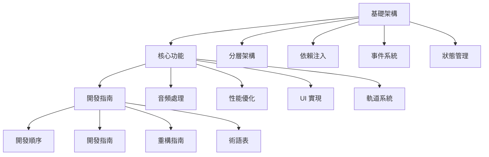

# DAW 系統架構文檔索引

## 系統架構概述

本目錄包含 DAW（Digital Audio Workstation）系統的所有架構相關文檔。系統採用分層架構設計，確保各層之間的職責明確，依賴關係清晰。

## 文檔結構

### 1. 基礎架構文檔

這些文檔描述了系統的基礎架構和核心機制。

1. [分層架構設計](layered-architecture.md)
   - 表現層（Presentation Layer）
   - 領域層（Domain Layer）
   - 數據層（Data Layer）
   - 基礎設施層（Infrastructure Layer）

2. [依賴注入系統](dependency-injection.md)
   - 服務註冊
   - 生命週期管理
   - 作用域管理
   - 工廠模式支持

3. [事件系統](event-system.md)
   - 事件總線
   - 事件轉換器
   - 事件日誌
   - 事件過濾

4. [狀態管理](state-management.md)
   - 狀態存儲
   - 狀態切片
   - 狀態管理器
   - 狀態持久化

### 2. 核心功能文檔

這些文檔描述了系統的核心功能和實現細節。

1. [音頻處理](audio-processing.md)
   - 音頻引擎
   - 音頻處理器
   - 音頻路由
   - 音頻緩衝管理

2. [性能優化](performance-optimization.md)
   - 音頻處理優化
   - UI 渲染優化
   - 事件系統優化
   - 資源管理優化

3. [UI 實現](pixijs-integration.md)
   - 渲染引擎設置
   - 場景管理
   - 音頻可視化
   - 交互控制
   - 性能優化
   - 動畫系統

4. [軌道系統設計](track/README.md)
   - 軌道模型
   - 軌道管理
   - 軌道操作
   - 軌道渲染

### 3. 開發指南文檔

這些文檔提供了開發流程和規範指導。

1. [開發順序](development-sequence.md)
   - 基礎設施層開發
   - 數據層開發
   - 領域層開發
   - 表現層開發
   - 系統整合
   - 測試與文檔

2. [開發指南](development-guide.md)
   - 專案架構
   - 開發規範
   - 開發流程
   - 最佳實踐
   - 測試指南
   - 部署指南
   - 維護指南

3. [重構指南](refactoring-guide.md)
   - 代碼組織
   - 命名規範
   - 重構策略
   - 測試要求

4. 術語表
   - [開發名詞表](technical-terms.md)
     - 架構相關術語
     - 技術實現術語
     - 開發工具術語
     - 性能優化術語
     - 安全相關術語
     - 監控和調試術語
   - [領域名詞表](domain-terms.md)
     - 音頻基礎術語
     - DAW 核心概念
     - 音頻編輯術語
     - 混音術語
     - 播放控制術語
     - 文件管理術語

## 文檔關係圖

## 文檔更新記錄

| 日期 | 版本 | 更新內容 | 作者 |
|------|------|----------|------|
| 2024-03-28 | 1.0.0 | 初始版本 | System |
| 2024-03-28 | 1.0.1 | 添加 PixiJS 整合文檔 | System |
| 2024-03-28 | 1.0.2 | 添加開發順序文檔 | System |
| 2024-03-29 | 1.0.3 | 添加開發指南文檔 | System |
| 2024-03-29 | 1.0.4 | 添加軌道系統文檔 | System |
| 2024-03-29 | 1.0.5 | 添加術語表文檔 | System |
| 2024-03-29 | 1.0.6 | 重新組織文檔結構 | System |

## 注意事項

1. **文檔維護**
   - 所有架構文檔應保持同步更新
   - 重大架構變更需要更新相關文檔
   - 保持文檔格式統一

2. **版本控制**
   - 文檔變更需要記錄在更新記錄中
   - 重要變更需要進行版本號更新
   - 保持文檔版本與代碼版本同步

3. **審查流程**
   - 新增文檔需要經過團隊審查
   - 重要更新需要團隊討論
   - 定期檢查文檔完整性

4. **文檔關係**
   - 基礎架構文檔提供系統框架
   - 核心功能文檔描述具體實現
   - 開發指南文檔指導開發流程
   - 術語表提供統一的術語定義

## 相關資源

- [TypeScript 文檔](https://www.typescriptlang.org/docs/)
- [PixiJS 文檔](https://pixijs.io/guides)
- [Web Audio API 文檔](https://developer.mozilla.org/en-US/docs/Web/API/Web_Audio_API)
