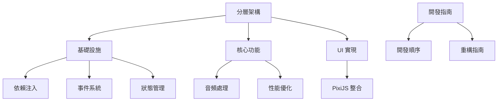

# DAW 系統架構文檔索引

## 系統架構概述

本目錄包含 DAW（Digital Audio Workstation）系統的所有架構相關文檔。系統採用分層架構設計，確保各層之間的職責明確，依賴關係清晰。

## 核心架構文檔

### 1. 分層架構
- [分層架構設計](layered-architecture.md)
  - 表現層（Presentation Layer）
  - 領域層（Domain Layer）
  - 數據層（Data Layer）
  - 基礎設施層（Infrastructure Layer）

### 2. 基礎設施
- [依賴注入系統](dependency-injection.md)
  - 服務註冊
  - 生命週期管理
  - 作用域管理
  - 工廠模式支持

- [事件系統](event-system.md)
  - 事件總線
  - 事件轉換器
  - 事件日誌
  - 事件過濾

- [狀態管理](state-management.md)
  - 狀態存儲
  - 狀態切片
  - 狀態管理器
  - 狀態持久化

### 3. 核心功能
- [音頻處理](audio-processing.md)
  - 音頻引擎
  - 音頻處理器
  - 音頻路由
  - 音頻緩衝管理

- [性能優化](performance-optimization.md)
  - 音頻處理優化
  - UI 渲染優化
  - 事件系統優化
  - 資源管理優化

### 4. UI 實現
- [PixiJS 整合](pixijs-integration.md)
  - 渲染引擎設置
  - 場景管理
  - 音頻可視化
  - 交互控制
  - 性能優化
  - 動畫系統

## 開發指南

### 1. 開發流程
- [開發順序](development-sequence.md)
  - 基礎設施層開發
  - 數據層開發
  - 領域層開發
  - 表現層開發
  - 系統整合
  - 測試與文檔

### 2. 代碼質量
- [重構指南](refactoring-guide.md)
  - 代碼組織
  - 命名規範
  - 重構策略
  - 測試要求

## 文檔關係圖

## 文檔更新記錄

| 日期 | 版本 | 更新內容 | 作者 |
|------|------|----------|------|
| 2024-03-28 | 1.0.0 | 初始版本 | System |
| 2024-03-28 | 1.0.1 | 添加 PixiJS 整合文檔 | System |
| 2024-03-28 | 1.0.2 | 添加開發順序文檔 | System |

## 注意事項

1. **文檔維護**
   - 所有架構文檔應保持同步更新
   - 重大架構變更需要更新相關文檔
   - 保持文檔格式統一

2. **版本控制**
   - 文檔變更需要記錄在更新記錄中
   - 重要變更需要進行版本號更新
   - 保持文檔版本與代碼版本同步

3. **審查流程**
   - 新增文檔需要經過團隊審查
   - 重要更新需要團隊討論
   - 定期檢查文檔完整性

## 相關資源

- [TypeScript 文檔](https://www.typescriptlang.org/docs/)
- [PixiJS 文檔](https://pixijs.io/guides)
- [Web Audio API 文檔](https://developer.mozilla.org/en-US/docs/Web/API/Web_Audio_API) 