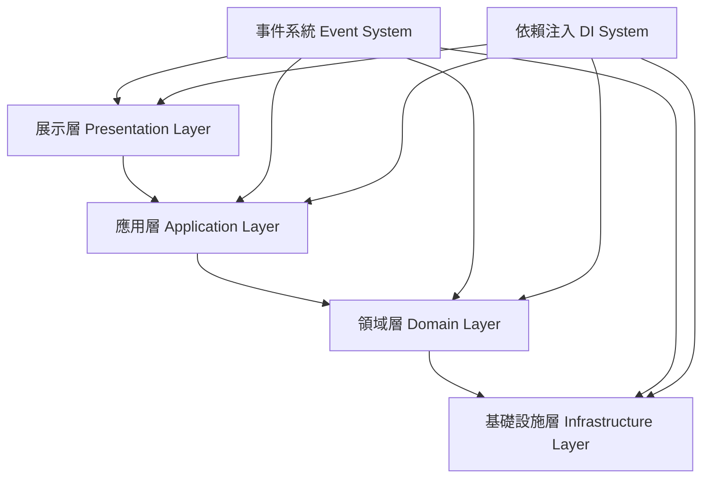

# DAW 分層架構文檔

## 1. 目錄結構

    ```
    src/
    ├── presentation/           # 表現層
    │   ├── components/        # UI 組件
    │   │   ├── daw/          # DAW 相關 UI
    │   │   │   ├── track/    # 軌道相關
    │   │   │   ├── timeline/ # 時間軸相關
    │   │   │   └── ui/       # 通用 UI
    │   │   └── common/       # 通用組件
    │   ├── containers/       # 容器組件
    │   └── core/            # 表現層核心
    │       └── PixiManager.ts
    │
    ├── domain/               # 領域層
    │   ├── daw/             # DAW 領域
    │   │   ├── track/       # 軌道領域
    │   │   ├── timeline/    # 時間軸領域
    │   │   └── audio/       # 音頻領域
    │   └── core/            # 領域層核心
    │       └── DAWManager.ts
    │
    ├── data/                 # 數據層
    │   ├── repositories/     # 數據倉庫
    │   ├── models/          # 數據模型
    │   └── store/           # 狀態管理
    │
    ├── core/                 # 核心功能
    │   ├── di/              # 依賴注入
    │   │   ├── types.ts     # 類型定義
    │   │   └── container.ts # 容器配置
    │   ├── events/          # 事件系統
    │   └── state/           # 狀態管理
    │       ├── StateManager.ts
    │       └── types.ts
    │
    ├── types/                # 類型定義
    ├── config/               # 配置文件
    └── utils/                # 工具函數
    ```

## 2. 依賴注入系統

### 2.1 概述

本專案使用 Inversify 作為依賴注入容器，提供了完整的依賴注入功能，包括：

- 類型安全的依賴注入
- 裝飾器支援
- 生命週期管理
- 作用域管理
- 工廠模式支援
- 循環依賴處理

### 2.2 核心組件

#### 2.2.1 類型定義 (types.ts)

    ```typescript
    // 定義服務標識符
    export const TYPES = {
        AudioContext: Symbol.for("AudioContext"),
        EventBus: Symbol.for("EventBus"),
        AudioEngine: Symbol.for("AudioEngine")
    };

    // 定義介面
    export interface IAudioContext {
        onInit(): void;
        onDestroy(): void;
    }

    // ... 其他介面定義
    ```

#### 2.2.2 容器配置 (container.ts)

    ```typescript
    @injectable()
    export class AudioContext implements IAudioContext {
        constructor() {
            this.onInit();
        }
        // ... 實現
    }

    // 服務註冊
    export function registerServices(): void {
        container.bind<IAudioContext>(TYPES.AudioContext)
            .to(AudioContext)
            .inSingletonScope();
        // ... 其他服務註冊
    }
    ```

### 2.3 使用方式

1. **註冊服務**

    ```typescript
    registerServices();
    ```

2. **獲取服務**

    ```typescript
    const engine = container.get<IAudioEngine>(TYPES.AudioEngine);
    ```

3. **使用服務**

    ```typescript
    engine.onInit();
    ```

### 2.4 最佳實踐

1. **使用介面**
   - 總是為服務定義介面
   - 使用介面而不是具體實現

2. **使用 Symbol 作為 Token**
   - 避免使用字串作為 Token
   - 使用 Symbol 確保唯一性

3. **適當的作用域**
   - 使用單例作用域共享狀態
   - 使用瞬態作用域避免狀態共享

4. **生命週期管理**
   - 實現 `onInit` 和 `onDestroy` 方法
   - 在適當的時機調用這些方法

5. **錯誤處理**
   - 使用 try-catch 處理初始化錯誤
   - 提供適當的錯誤信息

### 2.5 與其他層的整合

1. **表現層**
   - UI 組件通過 DI 獲取服務
   - 使用裝飾器注入依賴

2. **領域層**
   - 領域服務通過 DI 獲取依賴
   - 使用介面定義服務契約

3. **數據層**
   - 數據倉庫通過 DI 獲取配置
   - 使用工廠模式創建實例

## 3. 基礎接口定義

### 3.1 基礎服務接口

    ```typescript
    interface BaseService {
        initialize(): void;
        destroy(): void;
        isInitialized(): boolean;
    }

    class BaseServiceImpl implements BaseService {
        private initialized: boolean = false;
        
        initialize(): void {
            if (this.initialized) return;
            this.setup();
            this.initialized = true;
        }
        
        destroy(): void {
            if (!this.initialized) return;
            this.cleanup();
            this.initialized = false;
        }
        
        isInitialized(): boolean {
            return this.initialized;
        }
        
        protected setup(): void {
            // 由子類實現
        }
        
        protected cleanup(): void {
            // 由子類實現
        }
    }
    ```

### 3.2 基礎組件接口

    ```typescript
    interface BaseComponent {
        initialize(): void;
        setup(): void;
        update(): void;
        destroy(): void;
        isInitialized(): boolean;
    }

    abstract class BaseComponentImpl implements BaseComponent {
        private initialized: boolean = false;
        protected eventHandlers: EventHandlerManager;
        
        constructor() {
            this.eventHandlers = new EventHandlerManager();
        }
        
        initialize(): void {
            if (this.initialized) return;
            this.setup();
            this.initialized = true;
        }
        
        abstract setup(): void;
        
        update(): void {
            if (!this.initialized) return;
            // 由子類實現
        }
        
        destroy(): void {
            if (!this.initialized) return;
            this.cleanup();
            this.initialized = false;
        }
        
        isInitialized(): boolean {
            return this.initialized;
        }
        
        protected cleanup(): void {
            this.eventHandlers.clear();
        }
    }
    ```

## 4. 各層職責

### 4.1 表現層（Presentation Layer）

- 負責 UI 渲染和用戶交互
- 處理視覺效果和動畫
- 發送 UI 事件
- 監聽 Domain 事件並更新 UI
- 不包含業務邏輯
- 實現組件生命週期管理
- 處理用戶輸入驗證

### 4.2 領域層（Domain Layer）

- 實現核心業務邏輯
- 處理數據驗證和轉換
- 發送 Domain 事件
- 監聽 UI 事件並轉換為 Domain 事件
- 不依賴於具體的 UI 實現
- 實現服務生命週期管理
- 處理業務規則驗證

### 4.3 數據層（Data Layer）

- 管理數據持久化
- 提供數據訪問接口
- 實現數據模型
- 不包含業務邏輯
- 實現數據驗證
- 處理數據轉換
- 管理數據緩存

## 5. 層間通信

### 5.1 事件驅動通信

    ```typescript
    // 1. 定義事件轉換器
    class EventTranslator {
        constructor(
            private uiEventBus: UIEventBus,
            private domainEventBus: DomainEventBus
        ) {
            this.setupTranslations();
        }

        private setupTranslations(): void {
            // UI -> Domain 事件轉換
            this.setupUIToDomainTranslations();
            
            // Domain -> UI 事件轉換
            this.setupDomainToUITranslations();
        }

        private setupUIToDomainTranslations(): void {
            // 播放控制事件轉換
            this.uiEventBus.on('ui:playback:start', () => {
                this.domainEventBus.emit('domain:audio:playback:started');
            });

            // 軌道事件轉換
            this.uiEventBus.on('ui:track:add', (payload) => {
                const track = this.createTrackFromPayload(payload);
                this.domainEventBus.emit('domain:track:added', { track });
            });

            // 片段事件轉換
            this.uiEventBus.on('ui:clip:move', (payload) => {
                this.domainEventBus.emit('domain:clip:moved', {
                    clipId: payload.clipId,
                    newStartTime: payload.newPosition
                });
            });
        }

        private setupDomainToUITranslations(): void {
            // 音頻事件轉換
            this.domainEventBus.on('domain:audio:playback:started', () => {
                this.uiEventBus.emit('ui:playback:start');
            });

            // 軌道事件轉換
            this.domainEventBus.on('domain:track:added', (payload) => {
                this.uiEventBus.emit('ui:track:created', {
                    trackId: payload.track.id,
                    type: payload.track.type
                });
            });

            // 片段事件轉換
            this.domainEventBus.on('domain:clip:moved', (payload) => {
                this.uiEventBus.emit('ui:clip:updated', {
                    clipId: payload.clipId,
                    position: payload.newStartTime
                });
            });
        }

        private createTrackFromPayload(payload: any): Track {
            // 實現從 UI 事件數據創建領域模型的邏輯
            return new Track({
                id: payload.trackId,
                type: payload.type,
                // ... 其他屬性
            });
        }
    }

    // 2. 在依賴注入容器中註冊
    const container = Container.getInstance();
    container.register('EventTranslator', new EventTranslator(
        container.get('UIEventBus'),
        container.get('DomainEventBus')
    ));
    ```

### 5.2 服務調用通信

    ```typescript
    // 1. 定義服務接口
    interface ITrackPresenter {
        addTrack(name: string): void;
        removeTrack(id: string): void;
        playTrack(id: string): void;
        stopTrack(id: string): void;
    }

    interface IAudioPresenter {
        play(): void;
        stop(): void;
        pause(): void;
    }

    // 2. 實現 Presenter
    class TrackPresenter implements ITrackPresenter {
        constructor(
            private trackService: TrackService,
            private uiEventBus: UIEventBus,
            private domainEventBus: DomainEventBus
        ) {
            this.setupEventHandlers();
        }

        private setupEventHandlers(): void {
            // 處理 Domain 事件
            this.domainEventBus.on('domain:track:added', (payload) => {
                this.uiEventBus.emit('ui:track:created', {
                    trackId: payload.track.id
                });
            });
        }

        addTrack(name: string): void {
            this.trackService.addTrack(name);
        }

        removeTrack(id: string): void {
            this.trackService.removeTrack(id);
        }

        playTrack(id: string): void {
            this.trackService.playTrack(id);
        }

        stopTrack(id: string): void {
            this.trackService.stopTrack(id);
        }
    }

    // 3. 在組件中使用
    class TrackComponent extends BaseComponent {
        constructor(
            private trackPresenter: ITrackPresenter,
            private audioPresenter: IAudioPresenter
        ) {
            super();
        }

        private handleAddTrack(): void {
            this.trackPresenter.addTrack('New Track');
        }

        private handlePlayTrack(id: string): void {
            this.trackPresenter.playTrack(id);
            this.audioPresenter.play();
        }
    }

    // 4. 依賴注入配置
    class PresentationModule {
        static configure(container: Container): void {
            // 註冊 Presenters
            container.register('TrackPresenter', new TrackPresenter(
                container.get('TrackService'),
                container.get('UIEventBus'),
                container.get('DomainEventBus')
            ));

            container.register('AudioPresenter', new AudioPresenter(
                container.get('AudioService'),
                container.get('UIEventBus'),
                container.get('DomainEventBus')
            ));

            // 註冊組件
            container.register('TrackComponent', new TrackComponent(
                container.get('TrackPresenter'),
                container.get('AudioPresenter')
            ));
        }
    }
    ```

### 5.3 跨層通信最佳實踐

1. **事件驅動通信**
   - 使用事件轉換器處理層間事件轉換
   - 保持事件命名的一致性
   - 避免在事件處理器中執行耗時操作
   - 及時清理事件監聽器

2. **服務調用通信**
   - 使用 Presenter 模式處理層間服務調用
   - 定義清晰的服務接口
   - 避免直接依賴具體實現
   - 使用依賴注入管理服務實例

3. **數據轉換**
   - 在適當的層處理數據轉換
   - 使用 DTO 對象傳遞數據
   - 保持數據模型的一致性
   - 處理數據驗證和錯誤

4. **錯誤處理**
   - 在適當的層處理錯誤
   - 使用統一的錯誤類型
   - 提供清晰的錯誤信息
   - 實現錯誤恢復機制

5. **性能考慮**
   - 避免不必要的層間通信
   - 使用事件批處理
   - 實現數據緩存
   - 監控通信性能

## 6. 錯誤處理

### 6.1 錯誤類型定義

    ```typescript
    class DAWError extends Error {
        constructor(
            message: string,
            public code: string,
            public component: string
        ) {
            super(message);
            this.name = 'DAWError';
        }
    }

    class ValidationError extends DAWError {
        constructor(message: string, component: string) {
            super(message, 'VALIDATION_ERROR', component);
        }
    }

    class BusinessError extends DAWError {
        constructor(message: string, component: string) {
            super(message, 'BUSINESS_ERROR', component);
        }
    }
    ```

### 6.2 錯誤處理服務

    ```typescript
    class ErrorHandlingService {
        private static instance: ErrorHandlingService;
        
        static getInstance(): ErrorHandlingService {
            if (!ErrorHandlingService.instance) {
                ErrorHandlingService.instance = new ErrorHandlingService();
            }
            return ErrorHandlingService.instance;
        }
        
        handleError(error: DAWError): void {
            console.error(`[${error.component}] ${error.code}: ${error.message}`);
            // 可以添加錯誤報告邏輯
        }
    }
    ```

## 7. 系統整合

### 7.1 事件系統與狀態管理整合

    ```typescript
    // 狀態變更事件
    interface StateChangeEvent<T> extends Event {
        type: 'domain:state:changed';
        payload: {
            stateKey: string;
            oldValue: T;
            newValue: T;
            timestamp: number;
        };
    }

    // 狀態管理器與事件系統整合
    class StateManager {
        constructor(
            private eventBus: EventBus,
            private stateStore: StateStore
        ) {
            this.setupEventHandlers();
        }
        
        private setupEventHandlers(): void {
            // 監聽狀態變更事件
            this.eventBus.on('domain:state:changed', (event: StateChangeEvent<any>) => {
                this.handleStateChange(event.payload);
            });
        }
        
        private handleStateChange<T>(payload: {
            stateKey: string;
            oldValue: T;
            newValue: T;
            timestamp: number;
        }): void {
            // 更新狀態
            this.stateStore.update(payload.stateKey, payload.newValue);
            
            // 觸發 UI 更新事件
            this.eventBus.emit('ui:state:updated', {
                stateKey: payload.stateKey,
                value: payload.newValue
            });
        }
    }
    ```

### 7.2 依賴注入與分層整合

    ```typescript
    // 分層模組配置
    class PresentationModule {
        static configure(container: Container): void {
            // 註冊 UI 組件
            container.register('TrackComponent', {
                implementation: TrackComponent,
                scope: 'transient',
                dependencies: ['TrackService', 'EventBus']
            });
            
            // 註冊容器組件
            container.register('TrackContainer', {
                implementation: TrackContainer,
                scope: 'singleton',
                dependencies: ['TrackComponent', 'StateManager']
            });
        }
    }

    class DomainModule {
        static configure(container: Container): void {
            // 註冊領域服務
            container.register('TrackService', {
                implementation: TrackService,
                scope: 'singleton',
                dependencies: ['TrackRepository', 'AudioService']
            });
            
            // 註冊事件處理器
            container.register('TrackEventHandler', {
                implementation: TrackEventHandler,
                scope: 'singleton',
                dependencies: ['EventBus', 'StateManager']
            });
        }
    }

    class DataModule {
        static configure(container: Container): void {
            // 註冊數據倉庫
            container.register('TrackRepository', {
                implementation: TrackRepository,
                scope: 'singleton',
                dependencies: ['DatabaseService']
            });
            
            // 註冊狀態存儲
            container.register('StateStore', {
                implementation: StateStore,
                scope: 'singleton',
                dependencies: ['PersistenceService']
            });
        }
    }

    class InfrastructureModule {
        static configure(container: Container): void {
            // 註冊基礎設施服務
            container.register('DatabaseService', {
                implementation: DatabaseService,
                scope: 'singleton',
                dependencies: ['ConfigService']
            });
            
            container.register('PersistenceService', {
                implementation: PersistenceService,
                scope: 'singleton',
                dependencies: ['DatabaseService']
            });
            
            container.register('EventBus', {
                implementation: EventBus,
                scope: 'singleton'
            });
        }
    }
    ```

### 7.3 音頻處理與性能優化整合

    ```typescript
    // 音頻處理優化器
    class AudioProcessingOptimizer {
        constructor(
            private audioEngine: AudioEngine,
            private performanceMonitor: PerformanceMonitor
        ) {
            this.setupOptimization();
        }
        
        private setupOptimization(): void {
            // 監控音頻處理性能
            this.performanceMonitor.track('audio:processing', () => {
                return this.audioEngine.getProcessingTime();
            });
            
            // 動態調整緩衝區大小
            this.performanceMonitor.onThreshold('audio:processing', 16, () => {
                this.audioEngine.increaseBufferSize();
            });
            
            // 優化音頻路由
            this.audioEngine.on('route:created', (route) => {
                this.optimizeAudioRoute(route);
            });
        }
        
        private optimizeAudioRoute(route: AudioRoute): void {
            // 實現音頻路由優化邏輯
            route.setBufferSize(this.calculateOptimalBufferSize());
            route.setProcessingPriority(this.calculateProcessingPriority());
        }
        
        private calculateOptimalBufferSize(): number {
            // 根據系統性能動態計算緩衝區大小
            const processingTime = this.performanceMonitor.getMetric('audio:processing');
            return Math.max(256, Math.min(2048, processingTime * 1000));
        }
        
        private calculateProcessingPriority(): number {
            // 根據音頻重要性計算處理優先級
            return this.audioEngine.getActiveTracks().length > 8 ? 1 : 0;
        }
    }
    ```

### 7.4 系統啟動流程

    ```typescript
    class SystemBootstrap {
        constructor(private container: Container) {}
        
        async initialize(): Promise<void> {
            // 1. 初始化基礎設施
            await this.initializeInfrastructure();
            
            // 2. 初始化數據層
            await this.initializeDataLayer();
            
            // 3. 初始化領域層
            await this.initializeDomainLayer();
            
            // 4. 初始化表現層
            await this.initializePresentationLayer();
            
            // 5. 啟動性能監控
            this.startPerformanceMonitoring();
        }
        
        private async initializeInfrastructure(): Promise<void> {
            const infrastructureModule = new InfrastructureModule();
            infrastructureModule.configure(this.container);
            
            // 初始化基礎服務
            await this.container.get('DatabaseService').initialize();
            await this.container.get('EventBus').initialize();
        }
        
        private async initializeDataLayer(): Promise<void> {
            const dataModule = new DataModule();
            dataModule.configure(this.container);
            
            // 初始化數據服務
            await this.container.get('StateStore').initialize();
        }
        
        private async initializeDomainLayer(): Promise<void> {
            const domainModule = new DomainModule();
            domainModule.configure(this.container);
            
            // 初始化領域服務
            await this.container.get('TrackService').initialize();
        }
        
        private async initializePresentationLayer(): Promise<void> {
            const presentationModule = new PresentationModule();
            presentationModule.configure(this.container);
            
            // 初始化 UI 組件
            await this.container.get('TrackContainer').initialize();
        }
        
        private startPerformanceMonitoring(): void {
            const monitor = this.container.get('PerformanceMonitor');
            monitor.start();
        }
    }
    ```

## 8. 開發規範

### 8.1 命名規範

- 表現層組件：`XXXComponent`
- 領域層服務：`XXXService`
- 數據層倉庫：`XXXRepository`
- UI 事件：`ui:xxx`
- Domain 事件：`domain:xxx`
- 錯誤類型：`XXXError`

### 8.2 代碼組織

- 每個組件一個文件
- 相關功能放在同一目錄
- 使用 index.ts 導出公共接口
- 遵循單一職責原則
- 保持高內聚低耦合

### 8.3 錯誤處理

- 使用自定義錯誤類型
- 統一錯誤處理流程
- 提供詳細錯誤信息
- 實現錯誤恢復機制
- 記錄錯誤日誌

### 8.4 性能考慮

- 實現懶加載
- 使用緩存機制
- 優化事件處理
- 控制重繪頻率
- 監控性能指標

## 9. 數據流轉

### 9.1 DTO (Data Transfer Object) 模式
```typescript
// 數據層 DTO
interface ClipDTO {
  id: string;
  audioUrl: string;
  startTime: number;
  duration: number;
  position: number;
}

// 領域層模型
interface Clip {
  id: string;
  audioUrl: string;
  startTime: number;
  duration: number;
  position: number;
  
  // 領域邏輯
  updatePosition(position: number): void;
  updateStartTime(startTime: number): void;
}
```

### 9.2 Mapper 模式
```typescript
// 基礎設施層 Mapper
class ClipMapper {
  static toDTO(clip: Clip): ClipDTO {
    return {
      id: clip.id,
      audioUrl: clip.audioUrl,
      startTime: clip.startTime,
      duration: clip.duration,
      position: clip.position
    };
  }
  
  static toDomain(dto: ClipDTO): Clip {
    return new ClipImpl(
      dto.audioUrl,
      dto.startTime,
      dto.duration,
      dto.position
    );
  }
}
```

### 9.3 目錄結構
```
src/
├── data/                 // 數據層
│   ├── models/          // DTO 模型
│   └── repositories/    // 數據訪問實現
├── domain/              // 領域層
│   ├── models/         // 領域模型
│   └── repositories/   // 倉儲接口
└── infrastructure/      // 基礎設施層
    └── mappers/        // DTO 映射器
```

### 9.4 命名規範
1. **數據層**：
   - `ClipDTO`
   - `TrackDTO`
   - `ProjectDTO`

2. **領域層**：
   - `Clip`
   - `Track`
   - `Project`

3. **基礎設施層**：
   - `ClipMapper`
   - `TrackMapper`
   - `ProjectMapper`

## 10. 層間通信

### 10.1 數據層 → 領域層
- 使用 Mapper 將 DTO 轉換為領域模型
- 保持領域模型的純粹性
- 避免數據持久化邏輯污染領域邏輯

### 10.2 領域層 → 應用層
- 通過倉儲接口訪問數據
- 使用領域服務處理複雜業務邏輯
- 發布領域事件

### 10.3 應用層 → 展示層
- 使用 Presenter 轉換數據
- 處理 UI 事件
- 更新 UI 狀態

## 11. 依賴規則

1. **展示層**：
   - 依賴於應用層
   - 不直接依賴領域層
   - 不直接依賴基礎設施層

2. **應用層**：
   - 依賴於領域層
   - 不直接依賴基礎設施層
   - 不直接依賴展示層

3. **領域層**：
   - 不依賴於其他層
   - 定義核心業務規則
   - 定義倉儲接口

4. **基礎設施層**：
   - 依賴於領域層
   - 實現倉儲接口
   - 提供技術支持

## 12. 最佳實踐

1. **DTO 使用**：
   - 僅包含數據屬性
   - 不包含業務邏輯
   - 用於層間數據傳輸

2. **Mapper 實現**：
   - 保持映射邏輯簡單
   - 處理數據轉換
   - 處理默認值

3. **領域模型**：
   - 包含業務邏輯
   - 保持不可變性
   - 使用值對象

4. **倉儲模式**：
   - 定義於領域層
   - 實現於基礎設施層
   - 使用依賴注入

## 13. 注意事項

1. **性能考慮**：
   - 避免不必要的映射
   - 使用緩存優化
   - 批量處理數據

2. **維護性**：
   - 保持代碼簡潔
   - 遵循單一職責
   - 適當的註釋

3. **可測試性**：
   - 易於模擬依賴
   - 清晰的接口
   - 可預測的行為

# 分層架構設計

## 架構概述

本系統採用清晰的分層架構設計，每一層都有明確的職責和邊界。這種設計可以提高代碼的可維護性、可測試性和可擴展性。



## 分層詳解

### 1. 展示層（Presentation Layer）

#### 職責
- 處理用戶界面和交互
- 管理視圖狀態
- 處理用戶輸入
- 展示數據和反饋

#### 核心組件
- **React 組件**：UI 渲染和交互
- **Presenter**：業務邏輯和數據轉換
- **ViewModel**：視圖數據模型
- **事件處理器**：用戶操作響應

#### 關鍵實現
```typescript
// Presenter 示例
@injectable()
class TrackPresenter {
    constructor(
        @inject(TYPES.TrackService) private trackService: TrackService,
        @inject(TYPES.EventBus) private eventBus: EventBus
    ) {}

    async createTrack(name: string): Promise<void> {
        const track = await this.trackService.createTrack(name);
        this.eventBus.emit('track:created', track);
    }
}

// ViewModel 示例
interface TrackViewModel {
    id: string;
    name: string;
    volume: number;
    pan: number;
    isMuted: boolean;
    isSoloed: boolean;
}
```

### 2. 應用層（Application Layer）

#### 職責
- 協調業務流程
- 處理用戶操作
- 管理應用狀態
- 處理事件轉換

#### 核心組件
- **Service**：業務邏輯服務
- **EventHandler**：事件處理器
- **StateManager**：狀態管理
- **CommandHandler**：命令處理器

#### 關鍵實現
```typescript
// Service 示例
@injectable()
class TrackService {
    constructor(
        @inject(TYPES.TrackRepository) private trackRepo: TrackRepository,
        @inject(TYPES.AudioEngine) private audioEngine: AudioEngine
    ) {}

    async createTrack(name: string): Promise<Track> {
        const track = new Track(name);
        await this.trackRepo.save(track);
        this.audioEngine.createAudioTrack(track.id);
        return track;
    }
}
```

### 3. 領域層（Domain Layer）

#### 職責
- 實現核心業務邏輯
- 定義領域模型
- 維護業務規則
- 處理領域事件

#### 核心組件
- **Entity**：領域實體
- **ValueObject**：值對象
- **DomainEvent**：領域事件
- **Repository**：數據訪問接口

#### 關鍵實現
```typescript
// Entity 示例
class Track extends Entity {
    private _volume: number = 1;
    private _pan: number = 0;
    private _clips: Clip[] = [];

    constructor(
        public readonly name: string,
        public readonly id: string = uuid()
    ) {
        super();
    }

    addClip(clip: Clip): void {
        if (this.hasOverlappingClip(clip)) {
            throw new DomainError('Clip overlaps with existing clip');
        }
        this._clips.push(clip);
    }
}

// Repository 接口示例
interface TrackRepository {
    save(track: Track): Promise<void>;
    findById(id: string): Promise<Track | null>;
    findAll(): Promise<Track[]>;
    delete(id: string): Promise<void>;
}
```

### 4. 基礎設施層（Infrastructure Layer）

#### 職責
- 提供技術實現
- 處理外部集成
- 管理資源訪問
- 實現持久化

#### 核心組件
- **AudioEngine**：音頻引擎
- **StorageService**：存儲服務
- **EventBus**：事件總線
- **Logger**：日誌服務

#### 關鍵實現
```typescript
// AudioEngine 示例
@injectable()
class AudioEngine {
    private context: AudioContext;
    private tracks: Map<string, AudioTrack>;

    constructor() {
        this.context = new AudioContext();
        this.tracks = new Map();
    }

    createAudioTrack(id: string): void {
        const track = new AudioTrack(this.context);
        this.tracks.set(id, track);
    }
}

// StorageService 示例
@injectable()
class LocalStorageService implements StorageService {
    private prefix = 'daw_';

    async save<T>(key: string, data: T): Promise<void> {
        localStorage.setItem(
            this.prefix + key,
            JSON.stringify(data)
        );
    }
}
```

## 跨層級機制

### 1. 依賴注入（DI）

- 使用 Inversify 實現依賴注入
- 通過接口定義服務契約
- 支持生命週期管理
- 便於單元測試

### 2. 事件系統

- 採用發布/訂閱模式
- 支持同步和異步事件
- 實現層級間的解耦
- 提供事件追蹤

### 3. 錯誤處理

- 定義領域錯誤類型
- 實現錯誤轉換機制
- 統一錯誤處理流程
- 提供錯誤追蹤

## 開發規範

### 1. 依賴原則

- 遵循依賴倒置原則
- 避免跨層級直接依賴
- 通過接口進行通信
- 保持層級邊界清晰

### 2. 命名規範

- 使用明確的命名約定
- 遵循領域驅動設計術語
- 保持命名一致性
- 避免技術實現相關命名

### 3. 文件組織

- 按層級組織源代碼
- 遵循模塊化原則
- 保持相關代碼集中
- 避免循環依賴

## 測試策略

### 1. 單元測試

- 針對各層級的獨立組件
- 使用模擬對象隔離依賴
- 驗證業務邏輯正確性
- 保持測試代碼簡潔

### 2. 集成測試

- 驗證層級間的交互
- 測試關鍵業務流程
- 檢查事件處理機制
- 驗證數據一致性

### 3. 端到端測試

- 模擬用戶操作場景
- 驗證系統整體功能
- 檢查性能指標
- 測試錯誤處理

## 性能考慮

### 1. 數據流優化

- 減少跨層級數據傳遞
- 優化數據結構設計
- 實現數據緩存機制
- 避免不必要的轉換

### 2. 事件優化

- 合理使用事件機制
- 避免事件風暴
- 實現事件批處理
- 優化事件傳播路徑

### 3. 資源管理

- 及時釋放資源
- 實現資源池化
- 控制內存使用
- 優化 CPU 使用

## 擴展性設計

### 1. 插件機制

- 定義插件接口
- 支持動態加載
- 實現功能擴展
- 保持核心穩定

### 2. 配置管理

- 支持外部配置
- 實現運行時配置
- 管理環境變量
- 控制功能開關

### 3. 版本兼容

- 實現版本管理
- 處理向後兼容
- 支持平滑升級
- 維護接口穩定

## 參考資料

- [Clean Architecture](https://blog.cleancoder.com/uncle-bob/2012/08/13/the-clean-architecture.html)
- [Domain-Driven Design](https://domainlanguage.com/ddd/)
- [Onion Architecture](https://jeffreypalermo.com/2008/07/the-onion-architecture-part-1/)
- [SOLID Principles](https://en.wikipedia.org/wiki/SOLID)
