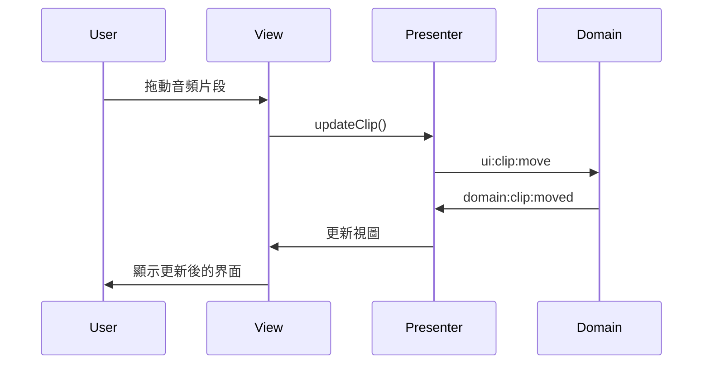

# Presentation Layer 架構文檔

## 1. 概述

本專案採用了 MVP（Model-View-Presenter）架構模式，主要包含以下幾個部分：

- View：React 組件，負責 UI 渲染
- Presenter：業務邏輯處理層，協調 View 和 Model 之間的交互
- ViewModel：數據展示模型，為 View 提供所需的數據結構
- Model：領域模型，包含核心業務邏輯

## 2. 目錄結構

```
src/presentation/
├── components/        # React 組件
├── graphics/         # PixiJS 相關類
├── models/          # View 模型
└── presenters/      # Presenter 類
```

## 3. 核心組件

### 3.1 Graphics 系統

#### RenderEngine
負責管理 PixiJS 的渲染引擎：

```typescript
interface RenderEngineConfig {
  width: number;
  height: number;
  backgroundColor: number;
  resolution?: number;
  antialias?: boolean;
  view: HTMLCanvasElement;
}

class RenderEngine {
  initialize(): void;
  destroy(): void;
  resize(width: number, height: number): void;
  getStage(): PIXI.Container;
}
```

#### DAWScene
管理 DAW 的場景渲染：

```typescript
interface DAWSceneConfig {
  width: number;
  height: number;
  trackCount: number;
  pixelsPerSecond: number;
}

class DAWScene {
  addClip(clip: ClipViewModel): PIXI.Container;
  removeClip(clipId: string): void;
  updateClip(clip: ClipViewModel): void;
  resize(width: number, height: number): void;
}
```

#### DragSystem
處理拖拽交互：

```typescript
interface DragConfig {
  onStart?: (target: PIXI.Container) => void;
  onMove?: (target: PIXI.Container, newPosition: PIXI.Point) => void;
  onEnd?: (target: PIXI.Container) => void;
}

class DragSystem {
  enableDrag(target: PIXI.Container): void;
  disableDrag(target: PIXI.Container): void;
}
```

### 3.2 Presenters

#### BasePresenter
所有 Presenter 的基類：

```typescript
abstract class BasePresenter {
  protected emit<K extends keyof UIEventPayload>(event: K, payload: UIEventPayload[K]): void;
  protected on<K extends keyof DomainEventPayload>(event: K, handler: (payload: DomainEventPayload[K]) => void): void;
  protected off<K extends keyof DomainEventPayload>(event: K, handler: (payload: DomainEventPayload[K]) => void): void;
}
```

#### DAWPresenter
處理 DAW 相關的業務邏輯：

```typescript
class DAWPresenter extends BasePresenter {
  addClip(clip: ClipViewModel): void;
  updateClip(clip: ClipViewModel): void;
  removeClip(clipId: string): void;
  
  private handleClipAdded(payload: DomainEventPayload['domain:clip:added']): void;
  private handleClipMoved(payload: DomainEventPayload['domain:clip:moved']): void;
  private handleClipDeleted(payload: DomainEventPayload['domain:clip:deleted']): void;
}
```

### 3.3 View Models

#### ClipViewModel
音頻片段的視圖模型：

```typescript
interface ClipViewModel {
  id: string;
  audioUrl: string;
  startTime: number;
  duration: number;
  position: number;
  name: string;
  trackId: string;
}
```

### 3.4 Components

#### DAWView
DAW 的主要視圖組件：

```typescript
interface DAWViewProps {
  width: number;
  height: number;
  presenter: DAWPresenter;
}

const DAWView: React.FC<DAWViewProps>;
```

## 4. 事件系統整合

### 4.1 UI 事件

```typescript
interface UIEventPayload {
  'ui:clip:add': {
    trackId: string;
    position: number;
    duration: number;
    audioUrl: string;
  };
  'ui:clip:move': {
    clipId: string;
    newPosition: number;
    trackId: string;
  };
  'ui:clip:delete': {
    clipId: string;
  };
}
```

### 4.2 Domain 事件

```typescript
interface DomainEventPayload {
  'domain:clip:added': {
    clip: ClipViewModel;
  };
  'domain:clip:moved': {
    clipId: string;
    newStartTime: number;
    trackId: string;
  };
  'domain:clip:deleted': {
    clipId: string;
  };
}
```

## 5. 事件流程

### 5.1 音頻片段操作流程

1. 用戶操作觸發 UI 事件
2. Presenter 接收 UI 事件並處理
3. Presenter 發送事件到 Domain 層
4. Domain 層處理並返回結果
5. Presenter 接收 Domain 事件
6. View 更新界面



## 6. 最佳實踐

### 6.1 事件處理
- 在 Presenter 中集中處理業務邏輯
- View 只負責渲染和用戶交互
- 使用 TypeScript 確保類型安全
- 及時清理事件監聽器

### 6.2 性能優化
- 使用 PixiJS 的對象池
- 實現虛擬滾動
- 優化事件處理器
- 減少不必要的重渲染

### 6.3 錯誤處理
- 捕獲並處理所有異常
- 提供用戶友好的錯誤提示
- 記錄錯誤日誌
- 實現錯誤恢復機制

### 6.4 測試策略
- 為每個 Presenter 編寫單元測試
- 測試事件處理邏輯
- 模擬用戶交互
- 驗證視圖更新

# 展示層架構指南

## 概述

本專案採用了 MVP（Model-View-Presenter）架構模式，主要包含以下幾個部分：

- View：React 組件，負責 UI 渲染
- Presenter：業務邏輯處理層，協調 View 和 Model 之間的交互
- ViewModel：數據展示模型，為 View 提供所需的數據結構
- Model：領域模型，包含核心業務邏輯

## 架構圖

```
+----------------+     +----------------+     +----------------+
|                |     |                |     |                |
|      View      |     |   Presenter    |     |     Model     |
|   (React UI)   |<--->|   (業務邏輯)   |<--->|   (領域模型)   |
|                |     |                |     |                |
+----------------+     +----------------+     +----------------+
         ^                    ^                     ^
         |                    |                     |
         v                    v                     v
+----------------+     +----------------+     +----------------+
|   ViewModel    |     |  EventSystem   |     | Repository    |
| (展示數據模型)  |     |   (事件系統)   |     |  (數據訪問)   |
+----------------+     +----------------+     +----------------+
```

## 組件職責

### 1. View 層

View 層主要由 React 組件構成，負責：
- UI 渲染
- 用戶交互處理
- 向 Presenter 發送事件
- 監聽並響應領域事件

```typescript
interface DAWViewProps {
  presenter: DAWPresenter;
}

const DAWView: React.FC<DAWViewProps> = ({ presenter }) => {
  const [clips, setClips] = useState<ClipViewModel[]>([]);
  const [tracks, setTracks] = useState<TrackViewModel[]>([]);

  useEffect(() => {
    // 監聽領域事件
    const unsubscribe = presenter.onClipsChanged(setClips);
    return () => unsubscribe();
  }, [presenter]);

  const handleAddClip = (trackId: string, position: number) => {
    presenter.addClip({
      trackId,
      position,
      duration: 4,
      audioUrl: 'path/to/audio.mp3'
    });
  };

  return (
    <div className="daw-container">
      <Timeline />
      <TracksContainer
        tracks={tracks}
        clips={clips}
        onAddClip={handleAddClip}
      />
      <Controls presenter={presenter} />
    </div>
  );
};
```

### 2. Presenter 層

Presenter 層負責：
- 處理業務邏輯
- 協調 View 和 Model 的交互
- 管理 ViewModel 的狀態
- 處理事件轉換

```typescript
@injectable()
class DAWPresenter {
  constructor(
    @inject(TYPES.UIEventBus) private uiEventBus: UIEventBus,
    @inject(TYPES.DomainEventBus) private domainEventBus: DomainEventBus,
    @inject(TYPES.ClipRepository) private clipRepository: ClipRepository,
    @inject(TYPES.AudioEngine) private audioEngine: AudioEngine
  ) {
    this.setupEventHandlers();
  }

  private setupEventHandlers() {
    // 處理 UI 事件
    this.uiEventBus.on('ui:clip:add', this.handleAddClip);
    this.uiEventBus.on('ui:playback:start', this.handlePlaybackStart);

    // 處理領域事件
    this.domainEventBus.on('domain:clip:added', this.updateClipViewModel);
    this.domainEventBus.on('domain:playback:started', this.updatePlaybackState);
  }

  public addClip(params: AddClipParams) {
    const clip = this.clipRepository.create(params);
    this.domainEventBus.emit('domain:clip:added', { clip });
  }

  public onClipsChanged(handler: (clips: ClipViewModel[]) => void) {
    return this.domainEventBus.on('domain:clip:added', () => {
      const clips = this.clipRepository.getAll();
      handler(clips);
    });
  }
}
```

### 3. ViewModel 層

ViewModel 層定義了展示模型：
- 為 View 提供所需的數據結構
- 處理數據格式轉換
- 提供計算屬性

```typescript
interface ClipViewModel {
  id: string;
  trackId: string;
  startTime: number;
  duration: number;
  waveform: WaveformData;
  color: string;
  selected: boolean;
  
  // 計算屬性
  endTime: number;
  width: number;
  left: number;
}

class ClipViewModelFactory {
  public static fromDomainModel(clip: Clip): ClipViewModel {
    return {
      id: clip.id,
      trackId: clip.trackId,
      startTime: clip.startTime,
      duration: clip.duration,
      waveform: clip.waveform,
      color: clip.color,
      selected: clip.selected,
      
      // 計算屬性
      get endTime() {
        return this.startTime + this.duration;
      },
      get width() {
        return this.duration * PIXELS_PER_SECOND;
      },
      get left() {
        return this.startTime * PIXELS_PER_SECOND;
      }
    };
  }
}
```

### 4. Model 層

Model 層包含：
- 領域模型
- 業務邏輯
- 數據驗證

```typescript
class Clip {
  constructor(
    public readonly id: string,
    public readonly trackId: string,
    private _startTime: number,
    private _duration: number,
    private _audioBuffer: AudioBuffer
  ) {}

  public move(newStartTime: number) {
    if (newStartTime < 0) {
      throw new Error('Start time cannot be negative');
    }
    this._startTime = newStartTime;
  }

  public resize(newDuration: number) {
    if (newDuration <= 0) {
      throw new Error('Duration must be positive');
    }
    if (newDuration > this._audioBuffer.duration) {
      throw new Error('Duration cannot exceed audio buffer length');
    }
    this._duration = newDuration;
  }
}
```

## 最佳實踐

### 1. 依賴注入

使用依賴注入來管理組件間的依賴關係：

```typescript
// 定義注入標識符
const TYPES = {
  DAWPresenter: Symbol.for('DAWPresenter'),
  ClipRepository: Symbol.for('ClipRepository'),
  AudioEngine: Symbol.for('AudioEngine'),
  UIEventBus: Symbol.for('UIEventBus'),
  DomainEventBus: Symbol.for('DomainEventBus')
};

// 配置依賴注入
container.bind<DAWPresenter>(TYPES.DAWPresenter).to(DAWPresenter).inSingletonScope();
container.bind<ClipRepository>(TYPES.ClipRepository).to(ClipRepository).inSingletonScope();
container.bind<AudioEngine>(TYPES.AudioEngine).to(AudioEngine).inSingletonScope();
```

### 2. 狀態管理

使用 React 的狀態管理機制：

```typescript
const useClips = (presenter: DAWPresenter) => {
  const [clips, setClips] = useState<ClipViewModel[]>([]);
  const [selectedClipId, setSelectedClipId] = useState<string | null>(null);

  useEffect(() => {
    const unsubscribe = presenter.onClipsChanged(setClips);
    return () => unsubscribe();
  }, [presenter]);

  const selectClip = (clipId: string) => {
    setSelectedClipId(clipId);
    presenter.selectClip(clipId);
  };

  return {
    clips,
    selectedClipId,
    selectClip
  };
};
```

### 3. 錯誤處理

實現統一的錯誤處理機制：

```typescript
@injectable()
class ErrorBoundary extends React.Component<{ presenter: DAWPresenter }> {
  componentDidCatch(error: Error) {
    this.props.presenter.handleError(error);
  }

  render() {
    return this.props.children;
  }
}

@injectable()
class ErrorHandler {
  constructor(
    @inject(TYPES.DomainEventBus) private domainEventBus: DomainEventBus
  ) {}

  public handleError(error: Error) {
    this.domainEventBus.emit('domain:error:occurred', {
      message: error.message,
      stack: error.stack
    });
  }
}
```

### 4. 性能優化

使用 React 的性能優化特性：

```typescript
const ClipView = React.memo<ClipViewProps>(({ clip, onSelect }) => {
  const handleClick = useCallback(() => {
    onSelect(clip.id);
  }, [clip.id, onSelect]);

  return (
    <div
      className="clip"
      style={{
        left: clip.left,
        width: clip.width
      }}
      onClick={handleClick}
    >
      <WaveformView data={clip.waveform} />
    </div>
  );
});
```

## 測試策略

### 1. 單元測試

```typescript
describe('DAWPresenter', () => {
  let presenter: DAWPresenter;
  let mockUiEventBus: MockEventBus;
  let mockDomainEventBus: MockEventBus;
  let mockClipRepository: MockClipRepository;

  beforeEach(() => {
    mockUiEventBus = new MockEventBus();
    mockDomainEventBus = new MockEventBus();
    mockClipRepository = new MockClipRepository();

    presenter = new DAWPresenter(
      mockUiEventBus,
      mockDomainEventBus,
      mockClipRepository
    );
  });

  it('should create and emit clip when handling add clip event', () => {
    const params = {
      trackId: '1',
      position: 0,
      duration: 4
    };

    presenter.addClip(params);

    expect(mockClipRepository.create).toHaveBeenCalledWith(params);
    expect(mockDomainEventBus.emit).toHaveBeenCalledWith(
      'domain:clip:added',
      expect.any(Object)
    );
  });
});
```

### 2. 集成測試

```typescript
describe('DAW Integration', () => {
  let container: Container;
  let presenter: DAWPresenter;
  let view: RenderResult;

  beforeEach(() => {
    container = new Container();
    setupDependencies(container);
    presenter = container.get(TYPES.DAWPresenter);
    
    view = render(
      <DAWView presenter={presenter} />
    );
  });

  it('should add clip when clicking add button', async () => {
    const addButton = view.getByText('Add Clip');
    fireEvent.click(addButton);

    await waitFor(() => {
      const clip = view.getByTestId('clip');
      expect(clip).toBeInTheDocument();
    });
  });
});
```

### 3. 端到端測試

```typescript
describe('DAW E2E', () => {
  it('should create and play clip', async () => {
    // 啟動應用
    await page.goto('http://localhost:3000');

    // 添加片段
    await page.click('[data-testid="add-clip-button"]');
    await page.waitForSelector('[data-testid="clip"]');

    // 播放片段
    await page.click('[data-testid="play-button"]');
    
    // 驗證播放狀態
    const isPlaying = await page.$eval(
      '[data-testid="transport"]',
      el => el.classList.contains('playing')
    );
    expect(isPlaying).toBe(true);
  });
});
```

## 擴展指南

### 1. 添加新功能

1. 定義 ViewModel：
```typescript
interface EffectViewModel {
  id: string;
  type: string;
  parameters: Record<string, number>;
}
```

2. 更新 Presenter：
```typescript
@injectable()
class EffectPresenter {
  constructor(
    @inject(TYPES.UIEventBus) private uiEventBus: UIEventBus,
    @inject(TYPES.EffectRepository) private effectRepository: EffectRepository
  ) {
    this.setupEventHandlers();
  }

  private setupEventHandlers() {
    this.uiEventBus.on('ui:effect:add', this.handleAddEffect);
    this.uiEventBus.on('ui:effect:update', this.handleUpdateEffect);
  }
}
```

3. 創建 View 組件：
```typescript
const EffectView: React.FC<EffectViewProps> = ({ effect, onUpdate }) => {
  return (
    <div className="effect-panel">
      <h3>{effect.type}</h3>
      {Object.entries(effect.parameters).map(([key, value]) => (
        <ParameterSlider
          key={key}
          name={key}
          value={value}
          onChange={value => onUpdate(key, value)}
        />
      ))}
    </div>
  );
};
```

### 2. 添加新的展示層功能

1. 創建新的 ViewModel 工廠：
```typescript
class ViewModelFactory {
  public static createViewModel<T extends keyof ViewModelMap>(
    type: T,
    data: any
  ): ViewModelMap[T] {
    switch (type) {
      case 'clip':
        return ClipViewModelFactory.fromDomainModel(data);
      case 'track':
        return TrackViewModelFactory.fromDomainModel(data);
      default:
        throw new Error(`Unknown view model type: ${type}`);
    }
  }
}
```

2. 實現新的展示邏輯：
```typescript
@injectable()
class TimelinePresenter {
  constructor(
    @inject(TYPES.UIEventBus) private uiEventBus: UIEventBus,
    @inject(TYPES.TimelineRepository) private timelineRepository: TimelineRepository
  ) {}

  public setTimeSignature(numerator: number, denominator: number) {
    this.timelineRepository.setTimeSignature(numerator, denominator);
    this.uiEventBus.emit('ui:timeline:updated', {
      timeSignature: { numerator, denominator }
    });
  }

  public setGridSize(size: number) {
    this.timelineRepository.setGridSize(size);
    this.uiEventBus.emit('ui:timeline:updated', { gridSize: size });
  }
}
```

## 參考資料

- [Model-View-Presenter Pattern](https://en.wikipedia.org/wiki/Model%E2%80%93view%E2%80%93presenter)
- [React Best Practices](https://reactjs.org/docs/thinking-in-react.html)
- [Dependency Injection in TypeScript](https://www.typescriptlang.org/docs/handbook/decorators.html)
- [Testing React Applications](https://testing-library.com/docs/react-testing-library/intro/) 