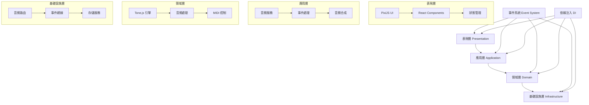

# ECHLUB DAW 架構文檔

## 項目概述

ECHLUB DAW 是一個基於網頁技術的數字音頻工作站（Digital Audio Workstation），使用 Tone.js 作為核心音頻引擎，提供專業的音頻處理和音樂製作功能。

### 核心特性

- 基於 Tone.js 的專業級音頻處理
- 高性能音頻可視化
- 實時音頻效果處理
- 多軌道編輯和混音
- 內置音頻合成器
- MIDI 控制支持
- 插件系統支持
- 協作功能

### 技術特點

- 使用 Tone.js 進行音頻處理和合成
- 使用 PixiJS 實現高性能渲染
- React 構建用戶界面
- 事件驅動架構
- 領域驅動設計

## 快速開始

### 1. 安裝依賴

```bash
npm install tone @types/tone pixi.js @types/pixi.js react react-dom @types/react @types/react-dom
```

### 2. 開發模式

```bash
npm run dev
```

### 3. 構建項目

```bash
npm run build
```

### 4. 運行測試

```bash
npm run test
```

## 文檔導覽

本目錄包含 ECHLUB DAW 的架構設計和實現文檔。

### 核心文檔

1. [技術架構](./technical_architecture.md)
   - 系統整體架構
   - 技術棧選擇
   - 架構原則和模式
   - 性能優化策略
   - 安全性考慮

2. [實現階段](./implementation_phases.md)
   - 開發階段劃分
   - 里程碑規劃
   - 優先級排序
   - 時間線安排
   - 資源分配

3. [組件設計](./component_design.md)
   - 核心組件設計
   - 接口定義
   - 數據流設計
   - 組件交互
   - 擴展機制

4. [音頻處理](./audio/README.md)
   - Tone.js 集成
   - 音頻效果器
   - 合成器設計
   - MIDI 控制
   - 音頻路由

## 系統架構



## 核心原則

### 1. 分層架構

- **職責分離**：每層具有明確的職責和邊界
- **依賴倒置**：高層模塊不依賴低層模塊的實現
- **關注點分離**：業務邏輯、展示邏輯和數據訪問的清晰分離

### 2. 事件驅動

- **鬆耦合設計**：組件間通過事件進行通信
- **可擴展性**：易於添加新功能和處理新類型的事件
- **響應式架構**：基於事件流的數據處理和狀態更新

### 3. 音頻處理

- **Tone.js 集成**：充分利用 Tone.js 的音頻處理能力
- **實時處理**：低延遲的音頻處理和效果器
- **MIDI 支持**：完整的 MIDI 輸入輸出支持

## 技術棧

### 音頻處理

- **核心引擎**：
  - Tone.js 14.x+
  - Web MIDI API
  - Web Audio API

### 前端技術

- **核心框架**：
  - TypeScript 5.0+
  - PixiJS 7.0+
  - React 18+

### 工具鏈

- **開發工具**：
  - Webpack 5
  - Babel 7
  - ESLint
  - Prettier

### 測試框架

- **測試工具**：
  - Jest
  - React Testing Library
  - Tone.js 測試工具

## 開發環境

### 1. 環境要求

- Node.js >= 18
- npm >= 9
- TypeScript >= 5.0
- Git >= 2.30

### 2. 開發工具

- VSCode 或 WebStorm
- Chrome DevTools
- Web MIDI 調試工具
- 音頻分析工具

### 3. 瀏覽器支持

- Chrome >= 90
- Firefox >= 88
- Safari >= 14
- Edge >= 90

## 音頻功能

### 1. 音頻處理

- Tone.js 音頻引擎
- 內置效果器
- 合成器模塊
- 音頻分析工具

### 2. MIDI 功能

- MIDI 輸入輸出
- MIDI 映射
- MIDI 時鐘同步
- MIDI 學習模式

### 3. 音頻路由

- 靈活的音頻路由系統
- 效果器鏈
- 發送/返回總線
- 側鏈壓縮

## 開發流程

### 1. 代碼管理

- 使用 Git Flow 工作流
- 遵循語義化版本控制
- 代碼審查流程

### 2. 質量控制

- 單元測試覆蓋率 > 80%
- 音頻處理測試
- 性能基準測試
- 自動化測試流程

### 3. 文檔維護

- 架構文檔及時更新
- API 文檔自動生成
- 音頻處理文檔
- 示例代碼維護

## 下一步

1. 查看 [技術架構](./technical_architecture.md) 了解系統設計詳情
2. 參考 [實現階段](./implementation_phases.md) 了解開發計劃和時間線
3. 研究 [組件設計](./component_design.md) 了解具體實現細節
4. 閱讀 [音頻處理](./audio/README.md) 了解音頻功能實現

## 貢獻指南

### 1. 開發規範

- 遵循 TypeScript 編碼規範
- 使用 ESLint 和 Prettier 保持代碼風格一致
- 遵循音頻處理最佳實踐
- 編寫完整的單元測試

### 2. 提交規範

- 使用語義化提交信息
- 創建清晰的 Pull Request
- 包含音頻處理測試
- 更新相關文檔

### 3. 音頻開發

- 遵循 Tone.js 最佳實踐
- 優化音頻性能
- 處理音頻延遲
- 實現錯誤處理

## 常見問題

### 1. 開發相關

- 環境配置問題
- 依賴安裝問題
- 編譯錯誤處理
- API 使用問題

### 2. 文檔相關

- API 文檔生成
- 文檔更新流程
- 版本控制說明
- 貢獻指南

### 3. 部署相關

- 構建流程說明
- 環境配置指南
- 性能優化建議
- 故障排除指南
