# ECHLUB DAW 組件設計

## 音頻核心組件

### AudioEngine

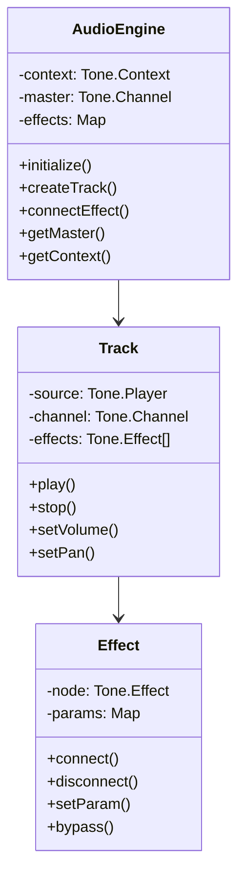

### 音頻處理流程

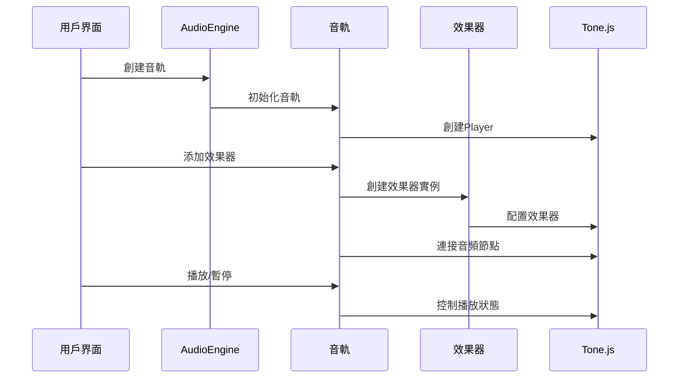

## MIDI組件

### MIDISystem

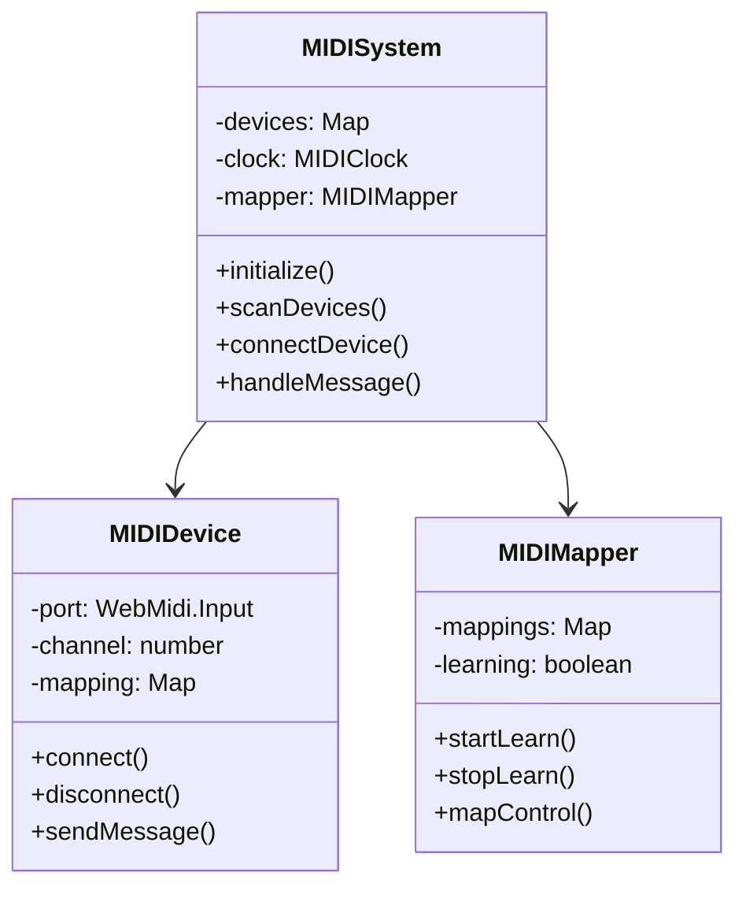

### MIDI處理流程

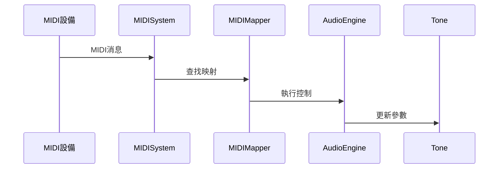

## 界面組件

### UI組件層次

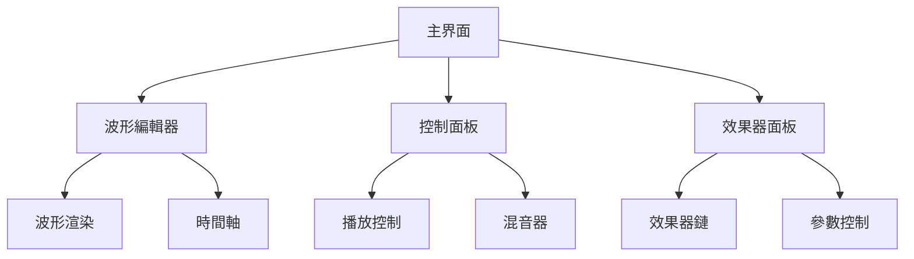

### 波形編輯器

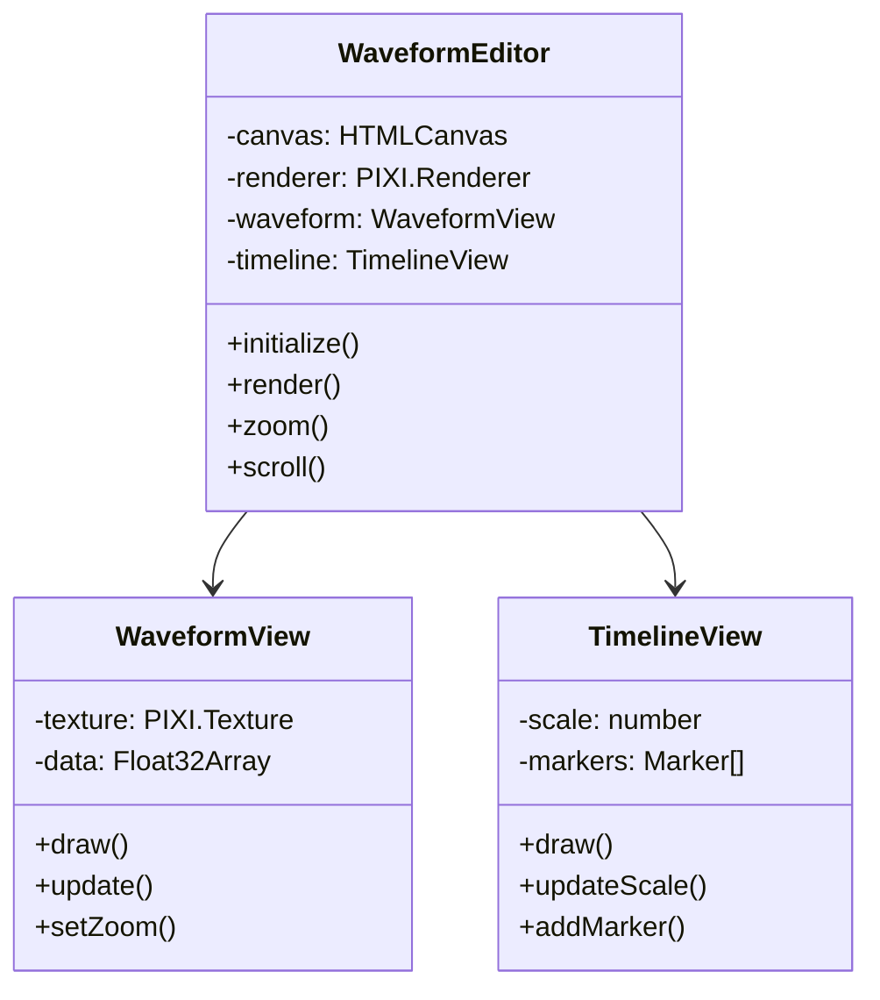

## 狀態管理

### 狀態流

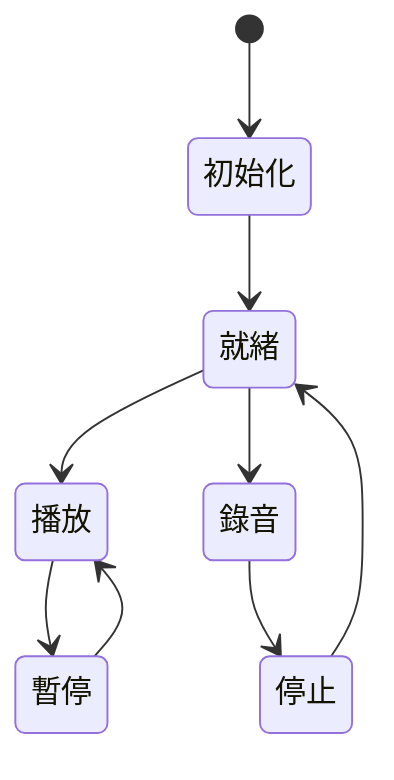

### 事件系統

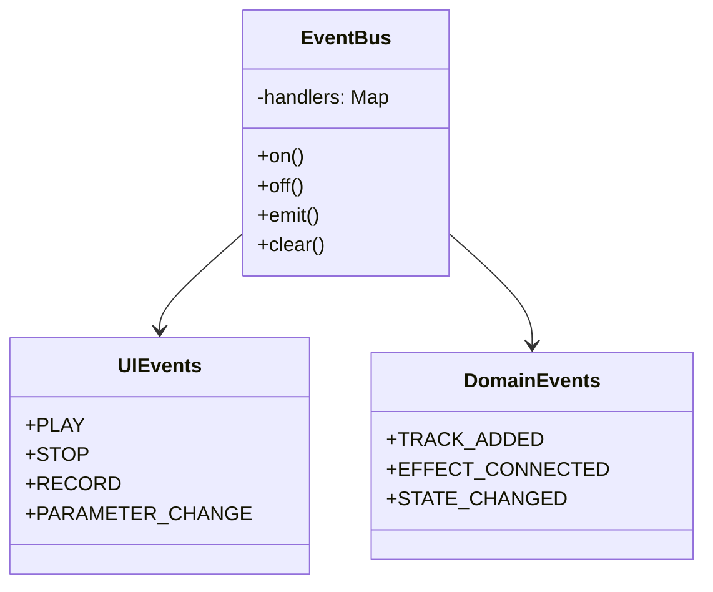

## 存儲系統

### 數據模型

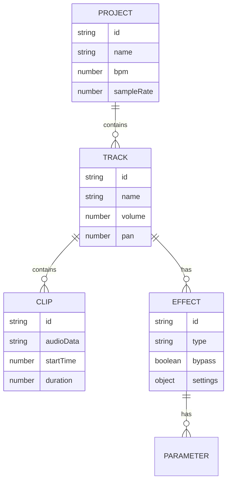

## 性能優化

### 關鍵性能指標

- 音頻延遲: < 10ms
- UI渲染幀率: > 60fps
- 內存使用: < 500MB
- 啟動時間: < 3s

### 優化策略

1. 音頻處理
   - 使用 Tone.js 的離線渲染
   - 音頻數據緩存
   - 動態節點創建

2. 渲染優化
   - WebGL 加速
   - 視圖懶加載
   - 局部更新

3. 內存管理
   - 音頻緩衝區重用
   - 對象池
   - 自動垃圾回收

## 協作功能

### 實時同步

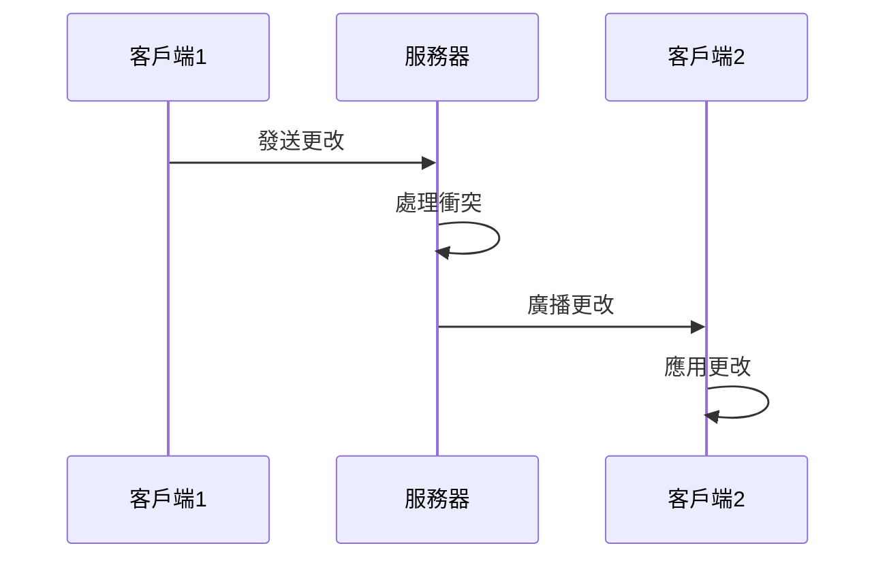

### 數據同步策略

1. 樂觀鎖定
2. CRDT 實現
3. 操作轉換

## 擴展性設計

### 插件系統

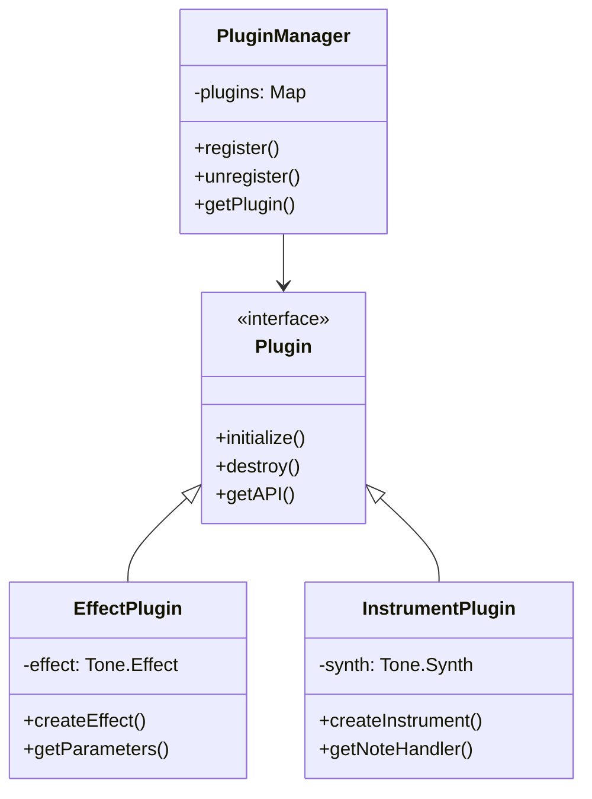

## 開發指南

### 代碼規範

1. TypeScript 強類型
2. 函數式編程原則
3. SOLID 設計原則
4. 測試驅動開發

### 文檔要求

1. API 文檔
2. 組件文檔
3. 性能基準
4. 測試用例

### 開發流程

1. 功能規劃
2. 技術評估
3. 原型實現
4. 代碼審查
5. 測試驗證
6. 性能優化
7. 文檔更新
