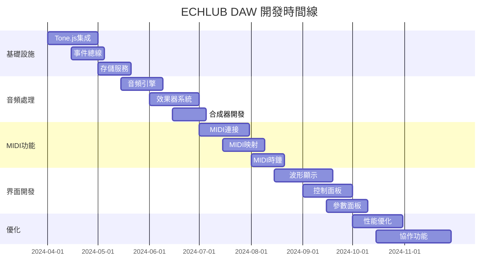

# ECHLUB DAW 實現階段

## 開發階段概覽

## 階段詳解

### Phase 1: 基礎設施層

#### 1.1 Tone.js 集成

- **目標**：實現穩定的音頻處理核心
- **關鍵任務**：
  - Tone.js 核心功能封裝
  - Transport 系統集成
  - 音頻節點管理
  - 定時器系統
- **技術重點**：
  - 音頻處理性能優化
  - 實時處理能力
  - 內存管理策略

#### 1.2 事件總線

- **目標**：建立高效的事件通信系統
- **關鍵任務**：
  - 事件發布/訂閱系統
  - 事件路由機制
  - 事件過濾器
  - 批處理優化
- **技術重點**：
  - 事件處理性能
  - 內存洩漏防護
  - 事件追踪能力

#### 1.3 存儲服務

- **目標**：實現可靠的數據持久化
- **關鍵任務**：
  - IndexedDB 封裝
  - 緩存策略
  - 數據同步機制
- **技術重點**：
  - 存儲性能優化
  - 數據完整性
  - 錯誤恢復機制

### Phase 2: 音頻處理

#### 2.1 音頻引擎

- **目標**：建立完整的音頻處理系統
- **關鍵任務**：
  - 音頻上下文管理
  - 音頻節點路由
  - 音頻分析功能
- **技術重點**：
  - Tone.js API 優化
  - 音頻處理性能
  - 延遲控制

#### 2.2 效果器系統

- **目標**：實現豐富的音頻效果
- **關鍵任務**：
  - 內置效果器開發
  - 效果器鏈管理
  - 參數自動化
- **技術重點**：
  - 效果器性能
  - 參數控制
  - 預設管理

#### 2.3 合成器開發

- **目標**：實現強大的音頻合成功能
- **關鍵任務**：
  - 合成器引擎開發
  - 調製系統實現
  - 濾波器系統
- **技術重點**：
  - 合成算法優化
  - 實時控制
  - 音色設計

### Phase 3: MIDI功能

#### 3.1 MIDI連接

- **目標**：實現穩定的MIDI設備支持
- **關鍵任務**：
  - MIDI設備檢測
  - MIDI消息處理
  - MIDI路由系統
- **技術重點**：
  - 設備兼容性
  - 消息處理性能
  - 錯誤處理

#### 3.2 MIDI映射

- **目標**：實現靈活的MIDI控制映射
- **關鍵任務**：
  - MIDI學習功能
  - 參數映射系統
  - 預設管理
- **技術重點**：
  - 映射邏輯優化
  - 用戶界面設計
  - 配置管理

#### 3.3 MIDI時鐘

- **目標**：實現精確的MIDI同步
- **關鍵任務**：
  - MIDI時鐘生成
  - 同步邏輯實現
  - 時鐘校準
- **技術重點**：
  - 時序精確性
  - 漂移補償
  - 性能優化

### Phase 4: 界面開發

#### 4.1 波形顯示

- **目標**：實現專業的音頻可視化
- **關鍵任務**：
  - 波形渲染引擎
  - 時間軸系統
  - 縮放控制
- **技術重點**：
  - WebGL優化
  - 渲染性能
  - 內存管理

#### 4.2 控制面板

- **目標**：提供直觀的控制界面
- **關鍵任務**：
  - 播放控制
  - 參數調節
  - MIDI控制
- **技術重點**：
  - 組件設計
  - 交互優化
  - 響應式布局

#### 4.3 參數面板

- **目標**：實現靈活的參數控制
- **關鍵任務**：
  - 參數顯示
  - 自動化編輯
  - 預設管理
- **技術重點**：
  - 界面性能
  - 數據綁定
  - 實時更新

### Phase 5: 優化

#### 5.1 性能優化

- **目標**：提升系統整體性能
- **關鍵任務**：
  - 音頻處理優化
  - 渲染性能優化
  - 內存管理優化
- **技術重點**：
  - 性能分析
  - 瓶頸識別
  - 優化策略

#### 5.2 協作功能

- **目標**：實現多人協作能力
- **關鍵任務**：
  - 實時同步
  - 衝突解決
  - 會話管理
- **技術重點**：
  - 網絡優化
  - 數據一致性
  - 用戶體驗

## 里程碑規劃

### Milestone 1: 基礎架構（2024 Q2）

- Tone.js 集成完成
- 事件系統運行
- 存儲服務可用

### Milestone 2: 核心功能（2024 Q3）

- 音頻處理系統完成
- MIDI功能實現
- 基礎UI可用

### Milestone 3: 完整功能（2024 Q4）

- 全部功能實現
- 性能達標
- 協作功能可用

## 優先級排序

### 高優先級

1. Tone.js 核心集成
2. 音頻處理系統
3. MIDI基礎功能

### 中優先級

1. 效果器系統
2. 界面開發
3. 合成器功能

### 低優先級

1. 協作功能
2. 高級MIDI功能
3. 插件系統
