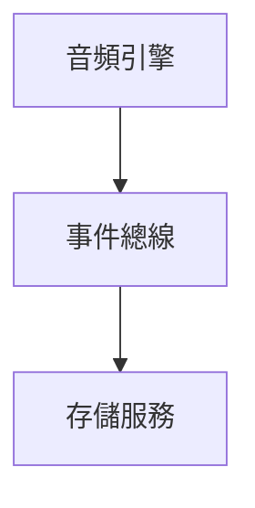
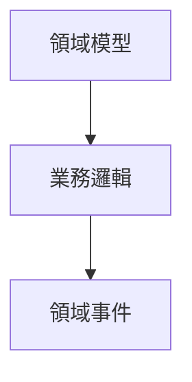
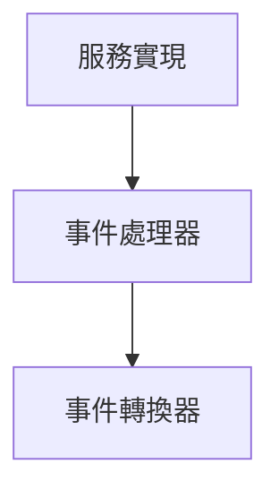
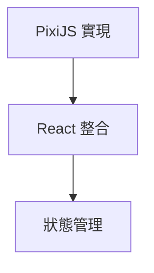
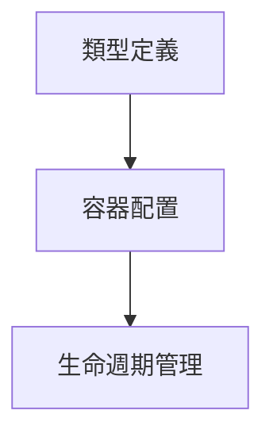
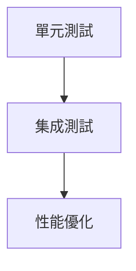
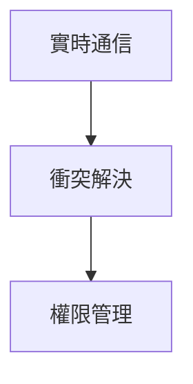

# ECHLUB DAW 實現計劃

## 概述

本文檔詳細描述了 ECHLUB DAW 的實現計劃，包括系統搭建的順序、每個階段的重點任務和預期成果。

## 實現順序

### Phase 1: 基礎設施層搭建

#### 1.1 音頻引擎 (Audio Engine)

- **核心功能**：
  - Web Audio API 的封裝和抽象
  - 音頻處理和效果器實現
  - 音頻緩衝區管理
- **技術選型**：
  - Web Audio API
  - AudioWorklet
  - WebAssembly（可選，用於複雜的音頻處理）

#### 1.2 事件總線 (Event Bus)

- **核心功能**：
  - 事件發布/訂閱系統
  - 同步和異步事件處理
  - 事件過濾和批處理
- **技術選型**：
  - TypeScript
  - RxJS（可選）

#### 1.3 存儲服務 (Storage Service)

- **核心功能**：
  - 音頻數據持久化
  - 項目數據管理
  - 緩存策略
- **技術選型**：
  - IndexedDB
  - LocalStorage
  - WebStorage API

### Phase 2: 領域層實現

#### 2.1 領域模型 (Domain Models)

- **核心實體**：
  - Track（音軌）
  - Clip（音頻片段）
  - Effect（音頻效果）
  - Project（專案）
- **值對象**：
  - TimeRange（時間範圍）
  - AudioParameters（音頻參數）
  - Position（位置信息）

#### 2.2 業務邏輯 (Business Logic)

- **核心功能**：
  - 音軌管理
  - 音頻編輯
  - 效果器處理
  - 專案管理

#### 2.3 領域事件 (Domain Events)

- **事件類型**：
  - TrackEvents（音軌事件）
  - ClipEvents（片段事件）
  - ProjectEvents（專案事件）
  - TransportEvents（播放控制事件）

### Phase 3: 應用層實現

#### 3.1 服務實現 (Services)

- **核心服務**：
  - TrackService（音軌服務）
  - AudioService（音頻服務）
  - ProjectService（專案服務）
  - TransportService（播放控制服務）

#### 3.2 事件處理器 (Event Handlers)

- **處理器類型**：
  - TrackEventHandler
  - ClipEventHandler
  - ProjectEventHandler
  - TransportEventHandler

#### 3.3 事件轉換器 (Event Translators)

- **轉換類型**：
  - UI 到領域事件的轉換
  - 領域到 UI 事件的轉換
  - 事件數據轉換和驗證

### Phase 4: 表現層實現

#### 4.1 PixiJS 實現

- **核心組件**：
  - Timeline（時間軸）
  - TrackView（音軌視圖）
  - ClipView（片段視圖）
  - WaveformView（波形視圖）

#### 4.2 React 整合

- **React 組件**：
  - 控制面板
  - 工具欄
  - 參數面板
  - 模態框

#### 4.3 狀態管理

- **狀態類型**：
  - UI 狀態
  - 應用狀態
  - 編輯狀態
  - 播放狀態

### Phase 5: 依賴注入配置

#### 5.1 類型定義

- **核心類型**：
  - 服務接口
  - 實現類型
  - 工廠類型

#### 5.2 容器配置

- **配置項**：
  - 服務註冊
  - 作用域設置
  - 依賴關係配置

### Phase 6: 測試和優化

#### 6.1 測試實現

- **測試類型**：
  - 單元測試
  - 集成測試
  - 端到端測試
  - 性能測試

#### 6.2 性能優化

- **優化方向**：
  - 渲染性能
  - 音頻處理性能
  - 內存管理
  - 事件處理優化

### Phase 7: 協作功能實現

#### 7.1 實時通信

- **功能實現**：
  - WebSocket 連接
  - WebRTC 音頻流
  - 實時數據同步

#### 7.2 協作功能

- **核心功能**：
  - 多人編輯
  - 衝突解決
  - 權限控制
  - 實時預覽

## 實現建議

1. **循序漸進**：
   - 從基礎設施層開始，確保核心功能的穩定性
   - 逐步添加業務邏輯和 UI 功能
   - 持續進行測試和優化

2. **技術選型**：
   - 使用 TypeScript 確保類型安全
   - 選擇成熟的框架和庫
   - 考慮性能和可維護性

3. **開發流程**：
   - 採用測試驅動開發（TDD）
   - 定期進行代碼審查
   - 持續集成和部署

4. **文檔管理**：
   - 及時更新技術文檔
   - 記錄設計決策
   - 維護 API 文檔

## 下一步行動

1. 設置開發環境
2. 實現基礎設施層的核心功能
3. 開始領域層的設計和實現
4. 逐步擴展系統功能

## 結論

此實現計劃提供了清晰的路線圖，幫助團隊有序地實現 ECHLUB DAW 的各項功能。通過遵循這個計劃，可以確保系統的穩定性和可擴展性。
