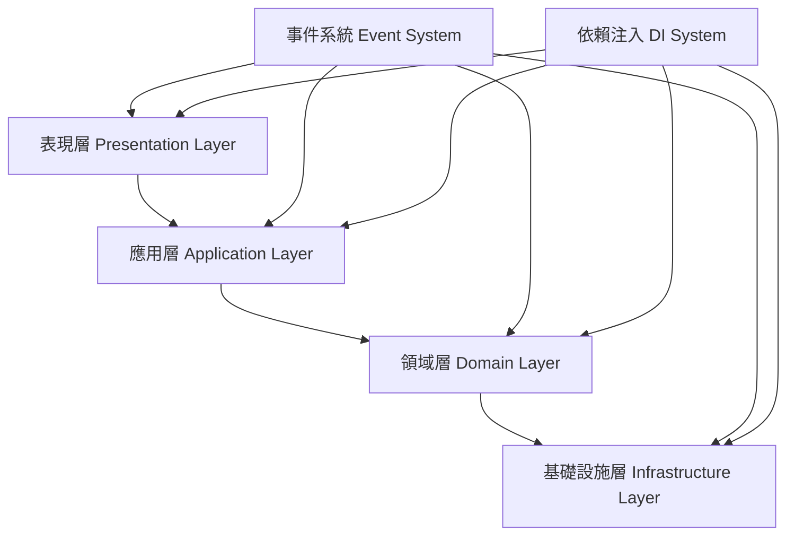

# ECHLUB DAW 專案架構

## 目錄結構

```
src/
├── app/                           # 應用啟動核心
│   ├── main.tsx                   # 入口檔（ReactDOM）
│   ├── registerModules.ts         # 模組集中註冊
│   └── AppRouter.tsx              # 路由定義（react-router）
│
├── core/                          # 共用核心設施
│   ├── di/                        # 依賴注入容器
│   │   ├── container.ts
│   │   └── types.ts               # DI token 定義
│   ├── events/                    # 自訂事件系統
│   │   ├── EventBus.ts
│   │   └── IEventBus.ts
│   ├── state/                     # 狀態管理系統（Redux-like）
│   │   ├── StateManager.ts
│   │   ├── IStateManager.ts
│   │   ├── StateStore.ts
│   │   ├── StateSlice.ts
│   │   └── persist/               # localStorage, IndexedDB 整合
│   ├── logger/                    # 日誌記錄（可整合 Sentry）
│   └── config/                    # 應用組態與常數
│
├── features/                      # 功能導向模組區（每個模組可獨立）
│   ├── TrackEditor/
│   │   ├── components/            # Track UI、Clip UI
│   │   ├── services/              # TrackService、ClipService 等
│   │   ├── store/                 # 狀態切片定義與註冊
│   │   ├── events/                # 與事件系統整合
│   │   ├── types.ts               # 模組內部型別定義
│   │   └── index.ts               # 導出註冊函數
│   ├── TransportBar/
│   ├── ProjectLoader/
│   └── ... 更多模組 ...
│
├── infrastructure/               # 資料存取層
│   ├── api/                       # 呼叫後端 API（fetch/axios）
│   ├── repositories/              # 與 domain 溝通的存取層
│   ├── storage/                   # localStorage, IndexedDB
│   └── project/                   # 專案存取器、autosave 邏輯
│
├── presentation/                 # UI 基底層（樣式、通用元件）
│   ├── components/                # 通用 React 元件（如 Modal, Button）
│   ├── layout/                    # Page Layout 結構
│   └── theme/                     # Tailwind / CSS Variables / dark mode
│
├── pixi/                         # PixiJS 管理與顯示相關模組
│   ├── PixiManager.ts             # Pixi 應用初始化與容器
│   ├── Renderer.ts                # 通用繪圖層
│   ├── UI/                        # Pixi UI 元件（如 ClipRect, Handle）
│   └── layers/                    # 分層渲染（背景層 / 事件層等）
│
├── types/                        # 全域型別定義
│   └── index.d.ts
│
├── utils/                        # 通用工具函式（格式化、Math、FPS 等）
│   ├── timeUtils.ts
│   ├── math.ts
│   └── audioHelpers.ts
│
└── index.html                    # Vite 預設 HTML 模板
```

## 架構說明

### 應用啟動核心 (app/)
- 集中管理應用程式的啟動流程
- 處理模組註冊和路由配置
- 提供應用程式的主要入口點

### 共用核心設施 (core/)
- 提供跨應用程式的核心功能
- 包含依賴注入、事件系統、狀態管理等基礎設施
- 提供可擴展的日誌記錄和配置管理

### 功能模組 (features/)
- 採用功能導向的模組化設計
- 每個模組都是獨立的功能單元
- 包含自己的 UI 組件、服務、狀態管理和事件處理

### 資料存取層 (infrastructure/)
- 處理所有外部數據交互
- 提供統一的 API 調用介面
- 管理數據持久化和專案存儲

### UI 基底層 (presentation/)
- 提供通用的 UI 組件庫
- 管理全局樣式和主題
- 實現一致的頁面布局結構

### PixiJS 相關 (pixi/)
- 管理 PixiJS 的初始化和渲染
- 提供自定義的 Pixi UI 組件
- 實現分層渲染系統

### 工具和類型 (types/, utils/)
- 定義全局使用的類型
- 提供通用的工具函數
- 確保代碼的可重用性和類型安全

## 設計原則

1. **模組化設計**
   - 每個功能模組都是獨立的
   - 通過明確的介面進行模組間通信
   - 降低模組間的耦合度

2. **依賴注入**
   - 使用 DI 容器管理依賴
   - 提高代碼的可測試性
   - 方便進行模組替換

3. **事件驅動**
   - 採用事件系統進行模組間通信
   - 實現鬆耦合的組件交互
   - 提供可擴展的事件處理機制

4. **狀態管理**
   - 集中管理應用狀態
   - 提供可預測的狀態更新機制
   - 支持狀態持久化和同步

5. **分層架構**
   - 清晰的職責分離
   - 統一的數據流向
   - 方便維護和擴展

## 概述

ECHLUB DAW 是一個基於 Web 技術的數位音頻工作站，專為音頻編輯、混音和製作而設計。此專案架構旨在支持其複雜的功能和多人協作需求。

## 架構設計

### 架構圖



### 組件職責描述

1. **表現層 (Presentation Layer)**：
   - **PixiJS 和 React**：負責 UI 的渲染和用戶交互。PixiJS 用於高效的圖形渲染，React 用於組件化的 UI 開發。
   - **狀態管理系統**：管理 UI 狀態，確保用戶界面與應用狀態同步。

2. **應用層 (Application Layer)**：
   - **業務邏輯協調**：負責協調業務邏輯和應用流程。
   - **服務和事件處理器**：處理用戶操作和業務邏輯，確保應用的正確運行。
   - **事件轉換器**：負責 UI 和領域事件之間的轉換，確保事件的正確傳遞。

3. **領域層 (Domain Layer)**：
   - **核心業務邏輯**：定義和實現核心業務邏輯。
   - **領域模型**：使用實體和值對象來表示業務概念。
   - **領域事件**：發布和處理領域事件。

4. **基礎設施層 (Infrastructure Layer)**：
   - **技術支持和外部集成**：提供技術支持和外部系統集成。
   - **音頻引擎和存儲服務**：實現音頻處理和數據存儲。
   - **事件總線**：管理事件的傳遞和處理。

### 1. 分層架構 (Layered Architecture)

#### 層級劃分

- **表現層 (Presentation Layer)**：
  - 使用 PixiJS 開發主要的 UI 介面，並混用 React。
  - 處理用戶交互和界面渲染。
  - 使用狀態管理系統（如 Redux 或自定義系統）來管理 UI 狀態。

- **應用層 (Application Layer)**：
  - 負責業務邏輯的協調和應用流程的管理。
  - 使用服務和事件處理器來處理用戶操作和業務邏輯。
  - 實現事件轉換器來處理 UI 和領域事件之間的轉換。

- **領域層 (Domain Layer)**：
  - 定義核心業務邏輯和領域模型。
  - 使用實體和值對象來表示業務概念。
  - 發布和處理領域事件。

- **基礎設施層 (Infrastructure Layer)**：
  - 提供技術支持和外部集成。
  - 實現音頻引擎、存儲服務和事件總線。
  - 管理資源訪問和持久化。

### 2. 事件驅動架構 (Event-Driven Architecture)

- 使用事件總線來實現層間通信。
- 支持同步和異步事件處理。
- 實現事件批處理和過濾來優化性能。

### 3. 依賴注入 (Dependency Injection)

- 使用 InversifyJS 來管理依賴注入。
- 定義類型安全的服務接口。
- 支持服務的生命週期管理和作用域管理。

### 4. 性能優化

- 實現狀態管理優化，如選擇器記憶化和批量更新。
- 使用事件批處理來減少不必要的事件傳播。
- 優化音頻處理性能，如動態調整緩衝區大小。

### 5. 測試策略

- **單元測試**：針對各層級的獨立組件進行測試。
- **集成測試**：驗證層級間的交互和關鍵業務流程。
- **端到端測試**：模擬用戶操作場景，驗證系統整體功能。

### 6. 協作功能

- 使用 WebSocket 和 WebRTC 實現實時通信和音頻流。
- 使用 CRDT 來解決協作衝突。
- 實現權限管理系統來控制用戶訪問。

## 結論

此專案架構結合了分層架構的清晰性和事件驅動架構的靈活性，適合支持 ECHLUB DAW 的複雜功能和多人協作需求。
