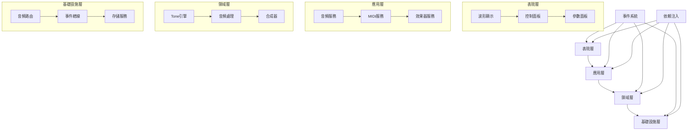

# ECHLUB DAW 技術架構

## 系統架構

## 架構層級詳解

### 1. 表現層 (Presentation Layer)

#### 1.1 波形顯示

- **職責**：
  - 音頻波形渲染
  - 時間軸顯示
  - 音頻可視化
  - 頻譜分析顯示

#### 1.2 控制面板

- **職責**：
  - 播放控制
  - 音量控制
  - 效果器參數調節
  - MIDI 控制映射

#### 1.3 參數面板

- **職責**：
  - 效果器參數顯示
  - 合成器參數控制
  - MIDI 映射配置
  - 音頻路由設置

### 2. 應用層 (Application Layer)

#### 2.1 音頻服務 (Audio Services)

- **ToneAudioService**：
  - Tone.js 音頻引擎管理
  - 音頻節點創建和連接
  - 音頻參數控制
  - 音頻狀態管理

#### 2.2 MIDI服務 (MIDI Services)

- **職責**：
  - MIDI 設備連接管理
  - MIDI 消息處理
  - MIDI 映射管理
  - MIDI 時鐘同步

#### 2.3 效果器服務 (Effect Services)

- **職責**：
  - 效果器創建和管理
  - 效果器鏈路由
  - 參數自動化
  - 預設管理

### 3. 領域層 (Domain Layer)

#### 3.1 Tone引擎 (Tone Engine)

- **核心功能**：
  - 音頻上下文管理
  - 音頻節點管理
  - 定時器系統
  - 音頻調度

#### 3.2 音頻處理 (Audio Processing)

- **功能**：
  - 實時音頻處理
  - 效果器處理
  - 音頻分析
  - 音頻緩衝管理

#### 3.3 合成器 (Synthesizer)

- **功能**：
  - 音頻合成
  - 包絡控制
  - 調製系統
  - 濾波器管理

### 4. 基礎設施層 (Infrastructure Layer)

#### 4.1 音頻路由 (Audio Routing)

- **組件**：
  - 音頻節點路由
  - 效果器鏈管理
  - 發送/返回總線
  - 側鏈處理

#### 4.2 事件總線 (Event Bus)

- **功能**：
  - 事件發布/訂閱
  - 事件路由
  - 事件過濾
  - 事件批處理

#### 4.3 存儲服務 (Storage Service)

- **功能**：
  - 項目數據持久化
  - 預設管理
  - 緩存策略
  - 數據同步

## 核心組件

### 1. Tone.js 集成

- **音頻引擎**：
  - Transport 系統
  - 音頻節點管理
  - 定時器系統
  - 音頻調度器

### 2. 音頻處理

- **效果器系統**：
  - 內置效果器
  - 自定義效果器
  - 效果器鏈
  - 參數自動化

### 3. MIDI 系統

- **MIDI 控制**：
  - MIDI 輸入/輸出
  - MIDI 學習
  - MIDI 映射
  - MIDI 時鐘

## 技術實現

### 1. 音頻處理

- Tone.js 核心功能
- Web Audio API 擴展
- AudioWorklet 處理
- WebAssembly 優化

### 2. 渲染系統

- PixiJS 渲染引擎
- WebGL 加速
- Canvas 2D 繪製
- SVG 圖形

### 3. 用戶界面

- React 組件系統
- 自定義 Hooks
- 狀態管理
- 主題系統

## 性能優化

### 1. 音頻處理

- AudioWorklet 線程
- WebAssembly 加速
- 音頻緩衝優化
- 延遲補償

### 2. 渲染優化

- WebGL 批處理
- 圖層管理
- 緩存策略
- 懶加載

### 3. 事件處理

- 事件批處理
- 事件節流
- 事件優先級
- 異步處理

## 擴展性設計

### 1. 插件系統

- 效果器插件
- 合成器插件
- MIDI 插件
- 工具插件

### 2. 預設系統

- 效果器預設
- 合成器預設
- MIDI 預設
- 項目模板

### 3. 自動化系統

- 參數自動化
- 包絡自動化
- MIDI 自動化
- 模塊化自動化

## 橫切關注點

### 1. 事件系統 (Event System)

- **設計原則**：
  - 鬆耦合
  - 可擴展
  - 高性能
- **實現方式**：
  - 自定義事件總線
  - 事件過濾和路由
  - 事件處理優化

### 2. 依賴注入 (Dependency Injection)

- **設計原則**：
  - 控制反轉
  - 依賴倒置
  - 單一職責
- **實現方式**：
  - InversifyJS 容器
  - 服務註冊
  - 生命週期管理

## 技術選型

### 1. 前端技術

- **TypeScript**: 靜態類型檢查
- **PixiJS**: 高性能渲染
- **React**: UI 組件
- **Web Audio API**: 音頻處理
- **AudioWorklet**: 音頻處理線程

### 2. 工具和框架

- **Webpack**: 模塊打包
- **Babel**: 代碼轉譯
- **Jest**: 單元測試
- **ESLint**: 代碼質量
- **Prettier**: 代碼格式化

## 性能考慮

### 1. 渲染優化

- WebGL 加速
- 虛擬列表
- 懶加載
- 緩存策略

### 2. 音頻處理

- AudioWorklet 處理
- WebAssembly 優化
- 音頻緩衝管理
- 實時處理優化

### 3. 事件處理

- 事件批處理
- 事件節流
- 事件優先級
- 異步處理

## 安全性

### 1. 數據安全

- 本地存儲加密
- 敏感數據處理
- 權限控制

### 2. 錯誤處理

- 全局錯誤捕獲
- 錯誤恢復機制
- 日誌記錄

## 可擴展性

### 1. 插件系統

- 插件接口設計
- 插件生命週期
- 插件通信

### 2. API 設計

- RESTful API
- WebSocket
- WebRTC
