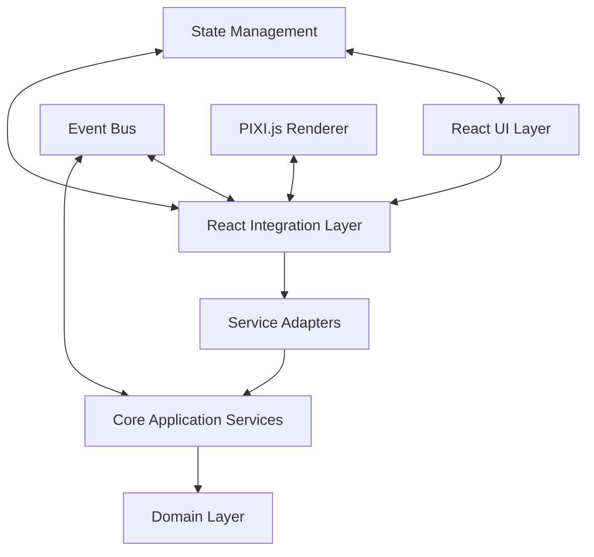

# Core Module and React Integration Strategy

**Version:** 1.0  
**Date:** December 2024  
**Author:** EchLub Development Team  
**Project:** EchLub Frontend - Core Module Integration  

## 1. Overview & Objectives

This document defines the integration strategy between EchLub Frontend's core modules (Music Arrangement, Collaboration, Jam Session, Identity, etc.) and the React frontend layer. The goal is to achieve an efficient, maintainable frontend integration solution while maintaining Clean Architecture principles.

### 1.1 Core Objectives

- **Architectural Consistency**: Maintain Clean Architecture's layered structure and dependency rules
- **Performance Optimization**: Achieve efficient state synchronization and event processing
- **Type Safety**: Comprehensive TypeScript support and type checking
- **Testability**: Each layer can be tested independently
- **Real-time Collaboration**: Support multi-user real-time collaboration features
- **Development Efficiency**: Provide clear development patterns and tools

### 1.2 Integration Challenges

- **State Synchronization**: Bidirectional synchronization between core module state and React state
- **Event Processing**: Efficient handling and propagation of cross-module events
- **Performance Considerations**: Avoid unnecessary re-renders and resource waste
- **Type Complexity**: Complex domain model to UI state transformations
- **Real-time Updates**: Immediate UI reflection of WebRTC collaboration events

## 2. Integration Architecture Design

### 2.1 Overall Architecture Overview



### 2.2 Layer Responsibility Definition

#### **React UI Layer**
- React components, Hooks, Context
- Pure UI logic and user interactions
- Visual state management (selection, dragging, animations, etc.)
- No business logic, only handles presentation and user input

#### **React Integration Layer**
- Service Adapters and Provider components
- State transformation and event mapping
- UI event to Command conversion
- Domain event to UI update transformation

#### **Service Adapters**
- React-friendly wrappers for core services
- State subscription and event listening
- Command execution and query processing
- Error handling and state recovery

#### **Core Application Services**
- Existing modular services
- CQRS Command/Query processing
- Event publishing and domain logic
- Cross-module coordination

## 3. Core Component Design

### 3.1 Service Adapter Pattern

Service Adapter serves as the bridge connecting React and core modules, providing React-friendly interfaces for each core module.

```typescript
// Base Service Adapter interface
interface ServiceAdapter<TState, TCommands, TQueries> {
  // State management
  getState(): TState;
  subscribe(listener: (state: TState) => void): () => void;
  
  // Command execution
  executeCommand<T extends keyof TCommands>(
    command: T,
    payload: TCommands[T]
  ): Promise<Result<void>>;
  
  // Query execution
  executeQuery<T extends keyof TQueries>(
    query: T,
    payload: TQueries[T]
  ): Promise<Result<any>>;
  
  // Event handling
  onEvent<T extends string>(
    eventType: T,
    handler: (event: any) => void
  ): () => void;
}

// Music Arrangement Service Adapter
interface MusicArrangementState {
  tracks: TrackViewModel[];
  clips: ClipViewModel[];
  playhead: PlayheadViewModel;
  selection: SelectionViewModel;
  collaborators: CollaboratorViewModel[];
  isPlaying: boolean;
  currentTime: number;
  bpm: number;
}

interface MusicArrangementCommands {
  createTrack: CreateTrackCommand;
  deleteTrack: DeleteTrackCommand;
  moveClip: MoveClipCommand;
  addMidiNote: AddMidiNoteCommand;
  startPlayback: StartPlaybackCommand;
  stopPlayback: StopPlaybackCommand;
}

interface MusicArrangementQueries {
  getTrackById: GetTrackByIdQuery;
  getClipsInTimeRange: GetClipsInTimeRangeQuery;
  getTracksByOwner: GetTracksByOwnerQuery;
}

@injectable()
export class MusicArrangementAdapter implements ServiceAdapter<
  MusicArrangementState,
  MusicArrangementCommands,
  MusicArrangementQueries
> {
  private currentState: MusicArrangementState;
  private listeners: Set<(state: MusicArrangementState) => void> = new Set();
  private eventListeners: Map<string, Set<Function>> = new Map();

  constructor(
    @inject(MusicArrangementTypes.MusicArrangementService)
    private readonly musicService: MusicArrangementService,
    @inject(MusicArrangementTypes.IntegrationEventBus)
    private readonly eventBus: IntegrationEventBus
  ) {
    this.currentState = this.initializeState();
    this.setupEventSubscriptions();
  }

  getState(): MusicArrangementState {
    return { ...this.currentState };
  }

  subscribe(listener: (state: MusicArrangementState) => void): () => void {
    this.listeners.add(listener);
    return () => this.listeners.delete(listener);
  }

  async executeCommand<T extends keyof MusicArrangementCommands>(
    command: T,
    payload: MusicArrangementCommands[T]
  ): Promise<Result<void>> {
    try {
      switch (command) {
        case 'createTrack':
          await this.musicService.createTrack(payload as CreateTrackCommand);
          break;
        case 'moveClip':
          await this.musicService.moveClip(payload as MoveClipCommand);
          break;
        // ... other commands
      }
      return Result.success(undefined);
    } catch (error) {
      return Result.failure(error.message);
    }
  }

  async executeQuery<T extends keyof MusicArrangementQueries>(
    query: T,
    payload: MusicArrangementQueries[T]
  ): Promise<Result<any>> {
    try {
      switch (query) {
        case 'getTrackById':
          const track = await this.musicService.getTrackById(payload as GetTrackByIdQuery);
          return Result.success(track);
        // ... other queries
      }
    } catch (error) {
      return Result.failure(error.message);
    }
  }

  onEvent<T extends string>(
    eventType: T,
    handler: (event: any) => void
  ): () => void {
    if (!this.eventListeners.has(eventType)) {
      this.eventListeners.set(eventType, new Set());
    }
    this.eventListeners.get(eventType)!.add(handler);
    
    return () => {
      this.eventListeners.get(eventType)?.delete(handler);
    };
  }

  private setupEventSubscriptions(): void {
    // Subscribe to domain events and update state
    this.eventBus.subscribe('music.track-created', this.handleTrackCreated.bind(this));
    this.eventBus.subscribe('music.clip-moved', this.handleClipMoved.bind(this));
    this.eventBus.subscribe('collaboration.peer-joined', this.handlePeerJoined.bind(this));
    // ... other event subscriptions
  }

  private handleTrackCreated(event: any): void {
    // Update state and notify listeners
    this.updateState(state => ({
      ...state,
      tracks: [...state.tracks, this.mapTrackToViewModel(event.track)]
    }));
  }

  private updateState(updater: (state: MusicArrangementState) => MusicArrangementState): void {
    this.currentState = updater(this.currentState);
    this.notifyListeners();
  }

  private notifyListeners(): void {
    this.listeners.forEach(listener => listener(this.currentState));
  }
}
```

### 3.2 React Provider Pattern

Use React Context and Provider pattern to provide global access to Service Adapters.

```typescript
// Music Arrangement Context
const MusicArrangementContext = createContext<MusicArrangementAdapter | null>(null);

interface MusicArrangementProviderProps {
  children: React.ReactNode;
}

export const MusicArrangementProvider: React.FC<MusicArrangementProviderProps> = ({
  children
}) => {
  const [adapter] = useState(() => {
    // Get adapter from DI container
    return container.get<MusicArrangementAdapter>(MusicArrangementTypes.MusicArrangementAdapter);
  });

  useEffect(() => {
    // Initialize adapter
    adapter.initialize?.();
    
    return () => {
      // Clean up resources
      adapter.dispose?.();
    };
  }, [adapter]);

  return (
    <MusicArrangementContext.Provider value={adapter}>
      {children}
    </MusicArrangementContext.Provider>
  );
};

// Custom Hook
export const useMusicArrangement = () => {
  const adapter = useContext(MusicArrangementContext);
  if (!adapter) {
    throw new Error('useMusicArrangement must be used within MusicArrangementProvider');
  }
  return adapter;
};
```

### 3.3 State Synchronization Hooks

Create dedicated Hooks to handle state synchronization and command execution.

```typescript
// State synchronization Hook
export const useMusicArrangementState = () => {
  const adapter = useMusicArrangement();
  const [state, setState] = useState(() => adapter.getState());

  useEffect(() => {
    const unsubscribe = adapter.subscribe(setState);
    return unsubscribe;
  }, [adapter]);

  return state;
};

// Command execution Hook
export const useMusicArrangementCommands = () => {
  const adapter = useMusicArrangement();

  const executeCommand = useCallback(
    async <T extends keyof MusicArrangementCommands>(
      command: T,
      payload: MusicArrangementCommands[T]
    ) => {
      const result = await adapter.executeCommand(command, payload);
      if (result.isFailure) {
        throw new Error(result.error);
      }
      return result.value;
    },
    [adapter]
  );

  return { executeCommand };
};

// Event listening Hook
export const useMusicArrangementEvents = <T extends string>(
  eventType: T,
  handler: (event: any) => void,
  deps: React.DependencyList = []
) => {
  const adapter = useMusicArrangement();

  useEffect(() => {
    const unsubscribe = adapter.onEvent(eventType, handler);
    return unsubscribe;
  }, [adapter, eventType, ...deps]);
};

// Composite Hook - Complete Music Arrangement functionality
export const useMusicArrangementService = () => {
  const state = useMusicArrangementState();
  const { executeCommand } = useMusicArrangementCommands();
  const adapter = useMusicArrangement();

  // Convenience methods
  const createTrack = useCallback(
    async (trackData: Omit<CreateTrackCommand, 'id'>) => {
      return executeCommand('createTrack', {
        ...trackData,
        id: generateId()
      });
    },
    [executeCommand]
  );

  const moveClip = useCallback(
    async (clipId: string, newTrackId: string, newStartTime: number) => {
      return executeCommand('moveClip', {
        clipId,
        newTrackId,
        newStartTime
      });
    },
    [executeCommand]
  );

  const startPlayback = useCallback(
    async () => {
      return executeCommand('startPlayback', {});
    },
    [executeCommand]
  );

  // Query methods
  const getTrackById = useCallback(
    async (trackId: string) => {
      return adapter.executeQuery('getTrackById', { trackId });
    },
    [adapter]
  );

  return {
    // State
    state,
    
    // Commands
    createTrack,
    moveClip,
    startPlayback,
    
    // Queries
    getTrackById,
    
    // Raw adapter (when needed)
    adapter
  };
};
```

### 3.4 View Model Mapping System

Define UI-friendly View Model mappings between domain models.

```typescript
// View Model definitions
interface TrackViewModel {
  id: string;
  name: string;
  type: 'audio' | 'instrument' | 'bus';
  color: string;
  volume: number;
  pan: number;
  isMuted: boolean;
  isSoloed: boolean;
  isSelected: boolean;
  isCollapsed: boolean;
  height: number;
  yPosition: number;
  clips: ClipViewModel[];
  collaborators: CollaboratorCursorViewModel[];
}

interface ClipViewModel {
  id: string;
  name: string;
  startTime: number;
  duration: number;
  trackId: string;
  color: string;
  isSelected: boolean;
  isDragging: boolean;
  isResizing: boolean;
  waveformData?: number[];
  midiNotes?: MidiNoteViewModel[];
  collaboratorCursors: CollaboratorCursorViewModel[];
}

interface CollaboratorCursorViewModel {
  collaboratorId: string;
  name: string;
  color: string;
  position: number;
  isActive: boolean;
}

// View Model mapper
export class MusicArrangementViewModelMapper {
  static mapTrackToViewModel(
    track: Track,
    uiState: { isSelected?: boolean; isCollapsed?: boolean; yPosition?: number } = {}
  ): TrackViewModel {
    return {
      id: track.getId(),
      name: track.getName(),
      type: track.getType() as 'audio' | 'instrument' | 'bus',
      color: track.getColor() || '#3498db',
      volume: track.getVolume(),
      pan: track.getPan(),
      isMuted: track.isMuted(),
      isSoloed: track.isSoloed(),
      isSelected: uiState.isSelected || false,
      isCollapsed: uiState.isCollapsed || false,
      height: uiState.isCollapsed ? 40 : 120,
      yPosition: uiState.yPosition || 0,
      clips: track.getClips().map(clip => this.mapClipToViewModel(clip)),
      collaborators: []
    };
  }

  static mapClipToViewModel(
    clip: Clip,
    uiState: { isSelected?: boolean; isDragging?: boolean } = {}
  ): ClipViewModel {
    return {
      id: clip.getId(),
      name: clip.getName(),
      startTime: clip.getStartTime(),
      duration: clip.getDuration(),
      trackId: clip.getTrackId(),
      color: clip.getColor() || '#e74c3c',
      isSelected: uiState.isSelected || false,
      isDragging: uiState.isDragging || false,
      isResizing: false,
      waveformData: clip.getWaveformData?.(),
      midiNotes: clip.getMidiNotes?.()?.map(note => this.mapMidiNoteToViewModel(note)),
      collaboratorCursors: []
    };
  }

  static mapMidiNoteToViewModel(note: MidiNote): MidiNoteViewModel {
    return {
      id: note.getId(),
      pitch: note.getPitch(),
      velocity: note.getVelocity(),
      startTime: note.getStartTime(),
      duration: note.getDuration(),
      isSelected: false
    };
  }
}
```

## 4. Real-time Collaboration Integration

### 4.1 Collaboration Event Handling

```typescript
// Collaboration adapter
@injectable()
export class CollaborationAdapter implements ServiceAdapter<
  CollaborationState,
  CollaborationCommands,
  CollaborationQueries
> {
  private currentState: CollaborationState;
  private listeners: Set<(state: CollaborationState) => void> = new Set();

  constructor(
    @inject(CollaborationTypes.CollaborationService)
    private readonly collaborationService: CollaborationService,
    @inject(MusicArrangementTypes.MusicArrangementAdapter)
    private readonly musicAdapter: MusicArrangementAdapter
  ) {
    this.setupCollaborationIntegration();
  }

  private setupCollaborationIntegration(): void {
    // Listen to collaboration events and sync to music module
    this.collaborationService.onPeerJoined((peerId, roomId) => {
      this.updateCollaboratorList();
      this.musicAdapter.onEvent('collaboration.peer-joined', { peerId, roomId });
    });

    this.collaborationService.onOperationReceived((operation) => {
      // Convert collaboration operations to music commands
      this.translateAndExecuteOperation(operation);
    });

    // Listen to music events and sync to collaboration module
    this.musicAdapter.onEvent('music.clip-moved', (event) => {
      this.collaborationService.broadcastOperation({
        type: 'clip-moved',
        clipId: event.clipId,
        newTrackId: event.newTrackId,
        newStartTime: event.newStartTime,
        userId: this.getCurrentUserId()
      });
    });
  }

  private async translateAndExecuteOperation(operation: CollaborationOperation): Promise<void> {
    switch (operation.type) {
      case 'clip-moved':
        await this.musicAdapter.executeCommand('moveClip', {
          clipId: operation.clipId,
          newTrackId: operation.newTrackId,
          newStartTime: operation.newStartTime
        });
        break;
      
      case 'track-created':
        await this.musicAdapter.executeCommand('createTrack', {
          name: operation.trackName,
          type: operation.trackType,
          ownerId: operation.userId
        });
        break;
      
      // ... other operation types
    }
  }
}
```

### 4.2 Real-time Cursor Synchronization

```typescript
// Collaboration cursor Hook
export const useCollaboratorCursors = () => {
  const collaborationAdapter = useCollaboration();
  const [cursors, setCursors] = useState<CollaboratorCursorViewModel[]>([]);

  useEffect(() => {
    const unsubscribe = collaborationAdapter.onEvent('cursor-moved', (event) => {
      setCursors(prev => {
        const existingIndex = prev.findIndex(c => c.collaboratorId === event.collaboratorId);
        const newCursor: CollaboratorCursorViewModel = {
          collaboratorId: event.collaboratorId,
          name: event.collaboratorName,
          color: event.collaboratorColor,
          position: event.position,
          isActive: true
        };

        if (existingIndex >= 0) {
          const updated = [...prev];
          updated[existingIndex] = newCursor;
          return updated;
        } else {
          return [...prev, newCursor];
        }
      });
    });

    return unsubscribe;
  }, [collaborationAdapter]);

  const updateCursorPosition = useCallback((position: number) => {
    collaborationAdapter.executeCommand('updateCursor', { position });
  }, [collaborationAdapter]);

  return {
    cursors,
    updateCursorPosition
  };
};
```

## 5. PIXI.js Renderer Integration

### 5.1 Integration with PIXI.js Renderer

Reference [PIXI.js Black-Box Renderer Design](./pixi-black-box-renderer-design.md) to integrate Service Adapter with PIXI.js renderer.

```typescript
// DAW Component - Main DAW interface component
export const DAWComponent: React.FC = () => {
  const musicService = useMusicArrangementService();
  const collaborationService = useCollaborationService();
  const { cursors } = useCollaboratorCursors();

  // Build PIXI.js scene state
  const sceneState = useMemo((): DAWSceneState => {
    return {
      viewport: {
        width: window.innerWidth,
        height: window.innerHeight,
        resolution: window.devicePixelRatio,
        devicePixelRatio: window.devicePixelRatio
      },
      timeline: {
        scrollX: musicService.state.scrollX,
        scrollY: musicService.state.scrollY,
        pixelsPerBeat: musicService.state.pixelsPerBeat,
        beatsPerMeasure: 4,
        snapToGrid: true,
        gridResolution: 16,
        visibleTimeRange: {
          start: musicService.state.scrollX / musicService.state.pixelsPerBeat,
          end: (musicService.state.scrollX + window.innerWidth) / musicService.state.pixelsPerBeat
        }
      },
      tracks: musicService.state.tracks.map(track => ({
        id: track.id,
        name: track.name,
        yPosition: track.yPosition,
        height: track.height,
        color: track.color,
        isMuted: track.isMuted,
        isSoloed: track.isSoloed,
        isSelected: track.isSelected,
        volume: track.volume,
        isCollapsed: track.isCollapsed,
        collaborators: cursors.filter(c => c.trackId === track.id)
      })),
      clips: musicService.state.clips.map(clip => ({
        id: clip.id,
        trackId: clip.trackId,
        name: clip.name,
        startTime: clip.startTime,
        duration: clip.duration,
        color: clip.color,
        isSelected: clip.isSelected,
        isDragging: clip.isDragging,
        isResizing: clip.isResizing,
        audioData: clip.waveformData ? {
          waveformPoints: clip.waveformData,
          peaks: calculatePeaks(clip.waveformData)
        } : undefined,
        collaboratorCursors: cursors.filter(c => c.clipId === clip.id)
      })),
      playhead: {
        currentTime: musicService.state.currentTime,
        isVisible: true,
        isPlaying: musicService.state.isPlaying,
        color: '#ff6b6b'
      },
      selection: {
        clips: musicService.state.selection.clips,
        tracks: musicService.state.selection.tracks,
        timeRange: musicService.state.selection.timeRange
      },
      tools: {
        activeTool: musicService.state.activeTool,
        toolSettings: musicService.state.toolSettings
      },
      collaborators: cursors,
      markers: musicService.state.markers,
      regions: musicService.state.regions,
      shouldRedrawWaveforms: musicService.state.shouldRedrawWaveforms,
      shouldRedrawGrid: musicService.state.shouldRedrawGrid,
      lastUpdateTimestamp: Date.now()
    };
  }, [musicService.state, cursors]);

  // Handle PIXI.js interaction events
  const handlePixiInteraction = useCallback(async (event: DAWInteractionEvent) => {
    switch (event.type) {
      case 'CLIP_MOVED':
        await musicService.moveClip(
          event.payload.clipId,
          event.payload.newTrackId,
          event.payload.newStartTime
        );
        break;
      
      case 'CLIP_SELECTED':
        musicService.selectClip(event.payload.clipId);
        break;
      
      case 'TRACK_SELECTED':
        musicService.selectTrack(event.payload.trackId);
        break;
      
      case 'TIMELINE_SCRUBBED':
        await musicService.setPlayheadPosition(event.payload.timePosition);
        break;
      
      case 'COLLABORATOR_CURSOR_MOVED':
        collaborationService.updateCursorPosition(event.payload.position);
        break;
      
      // ... other interaction events
    }
  }, [musicService, collaborationService]);

  return (
    <div className="daw-container">
      <PixiHostComponent
        sceneState={sceneState}
        onInteraction={handlePixiInteraction}
        className="daw-canvas"
        style={{ width: '100%', height: '100%' }}
      />
    </div>
  );
};
```

## 6. Error Handling and State Recovery

### 6.1 Unified Error Handling

```typescript
// Error handling Hook
export const useErrorHandler = () => {
  const [error, setError] = useState<Error | null>(null);

  const handleError = useCallback((error: Error) => {
    console.error('Application Error:', error);
    setError(error);
    
    // Send error events to analytics system
    errorReportingService.reportError(error);
  }, []);

  const clearError = useCallback(() => {
    setError(null);
  }, []);

  return { error, handleError, clearError };
};

// Error boundary component
export const ErrorBoundary: React.FC<{ children: React.ReactNode }> = ({ children }) => {
  const { error, handleError, clearError } = useErrorHandler();

  useEffect(() => {
    const handleUnhandledError = (event: ErrorEvent) => {
      handleError(new Error(event.message));
    };

    const handleUnhandledRejection = (event: PromiseRejectionEvent) => {
      handleError(new Error(event.reason));
    };

    window.addEventListener('error', handleUnhandledError);
    window.addEventListener('unhandledrejection', handleUnhandledRejection);

    return () => {
      window.removeEventListener('error', handleUnhandledError);
      window.removeEventListener('unhandledrejection', handleUnhandledRejection);
    };
  }, [handleError]);

  if (error) {
    return (
      <div className="error-boundary">
        <h2>Something went wrong</h2>
        <p>{error.message}</p>
        <button onClick={clearError}>Try Again</button>
      </div>
    );
  }

  return <>{children}</>;
};
```

### 6.2 State Recovery Mechanism

```typescript
// State persistence Hook
export const useStatePersistence = <T>(
  key: string,
  adapter: ServiceAdapter<T, any, any>
) => {
  const [isLoaded, setIsLoaded] = useState(false);

  useEffect(() => {
    // Load state from local storage
    const loadState = async () => {
      try {
        const savedState = localStorage.getItem(key);
        if (savedState) {
          const parsedState = JSON.parse(savedState);
          await adapter.restoreState(parsedState);
        }
      } catch (error) {
        console.error('Failed to load state:', error);
      } finally {
        setIsLoaded(true);
      }
    };

    loadState();
  }, [key, adapter]);

  useEffect(() => {
    if (!isLoaded) return;

    // Subscribe to state changes and auto-save
    const unsubscribe = adapter.subscribe((state) => {
      try {
        localStorage.setItem(key, JSON.stringify(state));
      } catch (error) {
        console.error('Failed to save state:', error);
      }
    });

    return unsubscribe;
  }, [key, adapter, isLoaded]);

  return { isLoaded };
};
```

## 7. Performance Optimization Strategies

### 7.1 Memoization and Optimization

```typescript
// Memoized state selector
export const useMemoizedTrackSelector = (trackId: string) => {
  const state = useMusicArrangementState();
  
  return useMemo(() => {
    return state.tracks.find(track => track.id === trackId);
  }, [state.tracks, trackId]);
};

// Deep comparison state updates
export const useDeepMemoizedState = <T>(
  selector: (state: MusicArrangementState) => T
) => {
  const state = useMusicArrangementState();
  const ref = useRef<T>();
  
  return useMemo(() => {
    const newValue = selector(state);
    if (!isEqual(ref.current, newValue)) {
      ref.current = newValue;
    }
    return ref.current!;
  }, [state, selector]);
};

// Batch command execution
export const useBatchCommands = () => {
  const { executeCommand } = useMusicArrangementCommands();
  const [commandQueue, setCommandQueue] = useState<Array<{ command: string; payload: any }>>([]);

  const queueCommand = useCallback((command: string, payload: any) => {
    setCommandQueue(prev => [...prev, { command, payload }]);
  }, []);

  const executeBatch = useCallback(async () => {
    if (commandQueue.length === 0) return;
    
    try {
      // Execute batch commands
      await Promise.all(
        commandQueue.map(({ command, payload }) => 
          executeCommand(command as any, payload)
        )
      );
      setCommandQueue([]);
    } catch (error) {
      console.error('Batch execution failed:', error);
      throw error;
    }
  }, [commandQueue, executeCommand]);

  return { queueCommand, executeBatch, queueLength: commandQueue.length };
};
```

### 7.2 Virtualization and Rendering Optimization

```typescript
// Virtualized track list
export const VirtualizedTrackList: React.FC<{
  tracks: TrackViewModel[];
  trackHeight: number;
  containerHeight: number;
}> = ({ tracks, trackHeight, containerHeight }) => {
  const [scrollTop, setScrollTop] = useState(0);
  
  const visibleRange = useMemo(() => {
    const startIndex = Math.floor(scrollTop / trackHeight);
    const endIndex = Math.min(
      startIndex + Math.ceil(containerHeight / trackHeight) + 1,
      tracks.length
    );
    return { startIndex, endIndex };
  }, [scrollTop, trackHeight, containerHeight, tracks.length]);

  const visibleTracks = useMemo(() => {
    return tracks.slice(visibleRange.startIndex, visibleRange.endIndex);
  }, [tracks, visibleRange]);

  return (
    <div 
      className="track-list-container"
      style={{ height: containerHeight, overflow: 'auto' }}
      onScroll={(e) => setScrollTop(e.currentTarget.scrollTop)}
    >
      <div style={{ height: tracks.length * trackHeight, position: 'relative' }}>
        {visibleTracks.map((track, index) => (
          <TrackComponent
            key={track.id}
            track={track}
            style={{
              position: 'absolute',
              top: (visibleRange.startIndex + index) * trackHeight,
              height: trackHeight
            }}
          />
        ))}
      </div>
    </div>
  );
};
```

## 8. Testing Strategy

### 8.1 Unit Testing

```typescript
// Service Adapter testing
describe('MusicArrangementAdapter', () => {
  let adapter: MusicArrangementAdapter;
  let mockMusicService: jest.Mocked<MusicArrangementService>;
  let mockEventBus: jest.Mocked<IntegrationEventBus>;

  beforeEach(() => {
    mockMusicService = createMockMusicService();
    mockEventBus = createMockEventBus();
    adapter = new MusicArrangementAdapter(mockMusicService, mockEventBus);
  });

  it('should update state when track is created', async () => {
    // Arrange
    const listener = jest.fn();
    adapter.subscribe(listener);
    const trackData = { name: 'Test Track', type: 'instrument' };

    // Act
    await adapter.executeCommand('createTrack', trackData);

    // Assert
    expect(listener).toHaveBeenCalledWith(
      expect.objectContaining({
        tracks: expect.arrayContaining([
          expect.objectContaining({ name: 'Test Track' })
        ])
      })
    );
  });

  it('should handle service errors gracefully', async () => {
    // Arrange
    mockMusicService.createTrack.mockRejectedValue(new Error('Service error'));

    // Act
    const result = await adapter.executeCommand('createTrack', { name: 'Test' });

    // Assert
    expect(result.isFailure).toBe(true);
    expect(result.error).toBe('Service error');
  });
});
```

### 8.2 Integration Testing

```typescript
// React integration testing
describe('MusicArrangement React Integration', () => {
  let container: Container;
  let adapter: MusicArrangementAdapter;

  beforeEach(() => {
    container = createTestContainer();
    adapter = container.get<MusicArrangementAdapter>(MusicArrangementTypes.MusicArrangementAdapter);
  });

  it('should render tracks and respond to interactions', async () => {
    // Arrange
    const TestComponent = () => {
      const { state, createTrack } = useMusicArrangementService();
      
      return (
        <div>
          <div data-testid="track-count">{state.tracks.length}</div>
          <button 
            data-testid="create-track"
            onClick={() => createTrack({ name: 'New Track', type: 'instrument' })}
          >
            Create Track
          </button>
        </div>
      );
    };

    const { getByTestId } = render(
      <MusicArrangementProvider>
        <TestComponent />
      </MusicArrangementProvider>
    );

    // Act
    fireEvent.click(getByTestId('create-track'));

    // Assert
    await waitFor(() => {
      expect(getByTestId('track-count')).toHaveTextContent('1');
    });
  });
});
```

### 8.3 E2E Testing

```typescript
// Cypress E2E testing
describe('DAW Workflow', () => {
  beforeEach(() => {
    cy.visit('/daw');
    cy.wait('@loadInitialData');
  });

  it('should create and manipulate tracks', () => {
    // Create track
    cy.get('[data-testid="create-track-button"]').click();
    cy.get('[data-testid="track-name-input"]').type('Piano Track');
    cy.get('[data-testid="confirm-create"]').click();

    // Verify track is created
    cy.get('[data-testid="track-list"]')
      .should('contain', 'Piano Track');

    // Add audio clip
    cy.get('[data-testid="upload-audio"]').selectFile('fixtures/test-audio.wav');
    cy.get('[data-testid="timeline"]').click(100, 50); // Place clip at specific position

    // Verify clip is added
    cy.get('[data-testid="clip"]').should('be.visible');

    // Playback test
    cy.get('[data-testid="play-button"]').click();
    cy.get('[data-testid="playhead"]').should('have.class', 'playing');
  });
});
```

## 9. Deployment and Monitoring

### 9.1 Performance Monitoring

```typescript
// Performance monitoring Hook
export const usePerformanceMonitoring = () => {
  const [metrics, setMetrics] = useState<PerformanceMetrics>({
    renderTime: 0,
    memoryUsage: 0,
    eventProcessingTime: 0
  });

  useEffect(() => {
    const observer = new PerformanceObserver((list) => {
      const entries = list.getEntries();
      const renderEntries = entries.filter(entry => entry.name.includes('render'));
      
      setMetrics(prev => ({
        ...prev,
        renderTime: renderEntries.reduce((sum, entry) => sum + entry.duration, 0)
      }));
    });

    observer.observe({ entryTypes: ['measure'] });

    return () => observer.disconnect();
  }, []);

  useEffect(() => {
    const updateMemoryUsage = () => {
      if ('memory' in performance) {
        setMetrics(prev => ({
          ...prev,
          memoryUsage: (performance as any).memory.usedJSHeapSize
        }));
      }
    };

    const interval = setInterval(updateMemoryUsage, 1000);
    return () => clearInterval(interval);
  }, []);

  return metrics;
};
```

### 9.2 Logging System

```typescript
// Structured logging
export const useStructuredLogging = () => {
  const logEvent = useCallback((
    level: 'info' | 'warn' | 'error',
    event: string,
    data?: any
  ) => {
    const logEntry = {
      timestamp: new Date().toISOString(),
      level,
      event,
      data,
      userAgent: navigator.userAgent,
      url: window.location.href
    };

    // Local console
    console[level](`[${level.toUpperCase()}] ${event}`, data);

    // Send to monitoring service
    if (process.env.NODE_ENV === 'production') {
      fetch('/api/logs', {
        method: 'POST',
        headers: { 'Content-Type': 'application/json' },
        body: JSON.stringify(logEntry)
      }).catch(console.error);
    }
  }, []);

  return { logEvent };
};
```

## 10. Conclusion

This integration strategy provides a complete solution for deep integration between EchLub's core modules and the React frontend layer. Through the Service Adapter pattern, Provider pattern, and specialized Hook system, we are able to:

1. **Maintain Architectural Purity**: Follow Clean Architecture principles while maintaining separation of concerns across layers
2. **Achieve High Performance**: Improve performance through memoization, virtualization, and batch processing techniques
3. **Support Real-time Collaboration**: Seamlessly integrate WebRTC collaboration features
4. **Provide Type Safety**: Comprehensive TypeScript support and type checking
5. **Ensure Testability**: Each layer has corresponding testing strategies
6. **Facilitate Maintenance**: Clear abstractions and pattern-based solutions

This strategy provides EchLub with a solid foundation that supports future feature expansion and performance optimization while maintaining code maintainability and team development efficiency.

## 11. References

- [PIXI.js Black-Box Renderer Design](./pixi-black-box-renderer-design.md)
- [EchLub Architecture Documentation](../architecture/)
- [Clean Architecture Principles](https://blog.cleancoder.com/uncle-bob/2012/08/13/the-clean-architecture.html)
- [React Performance Optimization](https://react.dev/learn/render-and-commit)
- [TypeScript Handbook](https://www.typescriptlang.org/docs/)

---

*This document is a living specification and will be updated as implementation progresses and requirements evolve.* 