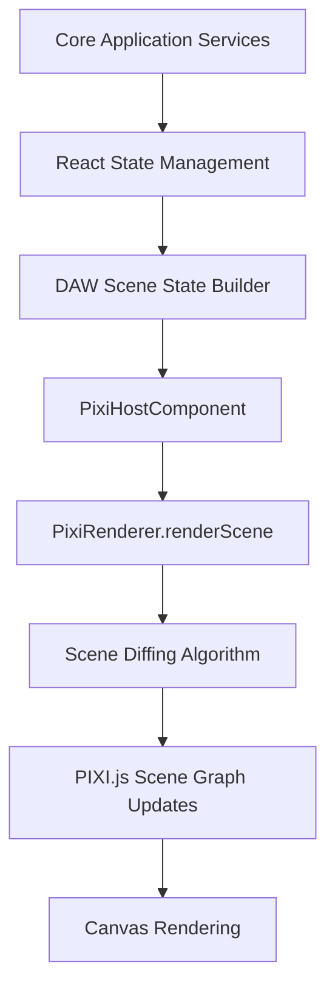
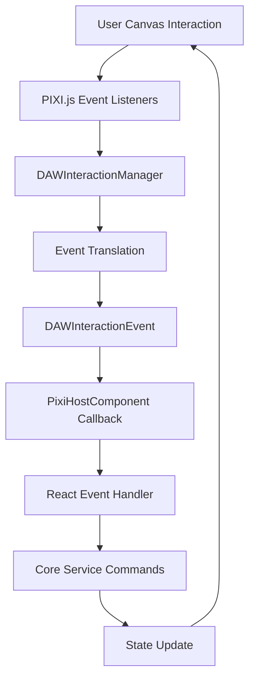

# Design Document: PIXI.js as a Black-Box Renderer for DAW UI

**Version:** 1.0  
**Date:** December 2024  
**Author:** EchLub Development Team  
**Project:** EchLub Frontend  

## 1. Introduction & Goals

This document outlines an architectural approach for integrating a PIXI.js-based Digital Audio Workstation (DAW) user interface with the React-driven EchLub Frontend application. The primary goal is to achieve a clean separation of concerns, high performance for complex graphical rendering, and strong maintainability by treating the PIXI.js rendering layer as a "black-box" managed by React.

This pattern aims to mitigate common issues arising from mixing React's declarative paradigm with PIXI.js's imperative API, particularly concerning lifecycle management, state synchronization, and performance optimization in the context of real-time audio collaboration.

### Key Objectives

- **Performance**: Enable smooth 60fps rendering for complex DAW interfaces with hundreds of audio clips and tracks
- **Maintainability**: Clear separation between React state management and PIXI.js rendering logic
- **Scalability**: Support for collaborative editing with multiple users without performance degradation
- **Integration**: Seamless integration with existing EchLub architecture and real-time collaboration features

## 2. Core Architectural Principles

### 2.1 Unidirectional Data Flow
React and the core application logic (Application/Domain Layers) serve as the "source of truth" for all state that needs to be visualized. The PIXI.js renderer is purely a presentation layer.

### 2.2 Clear Separation of Responsibilities

**React (Presentation Logic Layer):**
- Manages application state derived from core services
- Handles user interaction intent and business logic
- Passes declarative "scene descriptions" to the PIXI.js renderer
- Never directly manipulates PIXI.js objects

**PixiRenderer (Rendering Engine - The Black Box):**
- Receives scene descriptions and translates them into PIXI.js DisplayObject manipulations
- Manages the PIXI.js scene graph and rendering lifecycle
- Handles low-level canvas interactions and input events
- Emits high-level interaction events back to React
- Optimizes rendering performance through intelligent diffing and batching

### 2.3 Well-Defined Interface
Communication between React and PixiRenderer occurs through:
- A minimal, well-defined API
- Standardized scene state objects
- Typed interaction event system
- Clear contracts and interfaces

### 2.4 Decoupling Strategy
- React layer has minimal knowledge of PIXI.js internals
- PIXI.js layer focuses solely on rendering and input handling
- Business logic remains in the application layer
- Rendering optimizations are encapsulated within the renderer

## 3. Key Components and Data Structures

### 3.1 DAWSceneState Interface

A declarative, serializable JavaScript object that describes the entire visual state of the DAW UI at any given moment. This object is constructed by React based on data from application services.

```typescript
interface SceneViewport {
  width: number;
  height: number;
  resolution: number;
  devicePixelRatio: number;
}

interface SceneTimeline {
  scrollX: number;
  scrollY: number;
  pixelsPerBeat: number;
  beatsPerMeasure: number;
  snapToGrid: boolean;
  gridResolution: number;
  visibleTimeRange: {
    start: number;
    end: number;
  };
}

interface SceneTrack {
  id: string;
  name: string;
  yPosition: number;
  height: number;
  color: string;
  isMuted: boolean;
  isSoloed: boolean;
  isSelected: boolean;
  volume: number;
  isCollapsed: boolean;
  collaborators: SceneCollaborator[];
}

interface SceneClip {
  id: string;
  trackId: string;
  name: string;
  startTime: number;
  duration: number;
  color: string;
  isSelected: boolean;
  isDragging: boolean;
  isResizing: boolean;
  audioData?: {
    waveformPoints: number[];
    peaks: number[];
  };
  collaboratorCursors: SceneCollaboratorCursor[];
}

interface ScenePlayhead {
  currentTime: number;
  isVisible: boolean;
  isPlaying: boolean;
  color: string;
}

interface SceneCollaborator {
  id: string;
  name: string;
  color: string;
  cursor?: {
    x: number;
    y: number;
    isVisible: boolean;
  };
}

interface SceneCollaboratorCursor {
  collaboratorId: string;
  position: number;
  isActive: boolean;
}

interface SceneSelection {
  clips: string[];
  tracks: string[];
  timeRange?: {
    start: number;
    end: number;
  };
}

interface SceneTools {
  activeTool: 'select' | 'cut' | 'draw' | 'erase' | 'zoom';
  toolSettings: Record<string, any>;
}

interface DAWSceneState {
  viewport: SceneViewport;
  timeline: SceneTimeline;
  tracks: SceneTrack[];
  clips: SceneClip[];
  playhead: ScenePlayhead;
  selection: SceneSelection;
  tools: SceneTools;
  collaborators: SceneCollaborator[];
  markers: SceneMarker[];
  regions: SceneRegion[];
  // Performance optimization flags
  shouldRedrawWaveforms: boolean;
  shouldRedrawGrid: boolean;
  lastUpdateTimestamp: number;
}

interface SceneMarker {
  id: string;
  time: number;
  label: string;
  color: string;
  isVisible: boolean;
}

interface SceneRegion {
  id: string;
  startTime: number;
  endTime: number;
  trackIds: string[];
  color: string;
  opacity: number;
  label?: string;
}
```

### 3.2 PixiRenderer Class

The core black-box rendering engine responsible for all PIXI.js operations.

```typescript
interface PixiRendererConfig {
  canvas: HTMLCanvasElement;
  backgroundColor: number;
  antialias: boolean;
  preserveDrawingBuffer: boolean;
  powerPreference: 'high-performance' | 'low-power' | 'default';
}

interface PixiRendererOptions {
  enableDebugMode: boolean;
  maxFPS: number;
  enableWaveformCaching: boolean;
  enableCollaboratorCursors: boolean;
}

class PixiRenderer {
  private app: PIXI.Application;
  private currentScene: DAWSceneState | null = null;
  private sceneGraph: DAWSceneGraph;
  private interactionManager: DAWInteractionManager;
  private performanceMonitor: PerformanceMonitor;
  
  constructor(config: PixiRendererConfig, options: PixiRendererOptions) {
    // Initialize PIXI.js application and core systems
  }

  /**
   * Main rendering method called by React when scene state changes
   */
  public renderScene(newState: DAWSceneState): void {
    const diff = this.calculateSceneDiff(this.currentScene, newState);
    this.applySceneUpdates(diff);
    this.currentScene = newState;
  }

  /**
   * Handle canvas resize events
   */
  public resize(width: number, height: number): void {
    this.app.renderer.resize(width, height);
    this.sceneGraph.handleResize(width, height);
  }

  /**
   * Set interaction event callback
   */
  public onInteraction(callback: (event: DAWInteractionEvent) => void): void {
    this.interactionManager.setCallback(callback);
  }

  /**
   * Cleanup resources
   */
  public destroy(): void {
    this.app.destroy(true, true);
    this.sceneGraph.destroy();
    this.interactionManager.destroy();
  }

  /**
   * Performance optimization methods
   */
  public enablePerformanceMode(enabled: boolean): void {
    this.app.ticker.maxFPS = enabled ? 30 : 60;
  }

  public getPerformanceMetrics(): PerformanceMetrics {
    return this.performanceMonitor.getMetrics();
  }

  private calculateSceneDiff(oldState: DAWSceneState | null, newState: DAWSceneState): SceneDiff {
    // Efficient diffing algorithm implementation
  }

  private applySceneUpdates(diff: SceneDiff): void {
    // Apply only necessary updates to PIXI.js scene graph
  }
}
```

### 3.3 DAWInteractionEvent System

Standardized event structure for communication from PIXI.js back to React.

```typescript
type DAWInteractionType =
  | 'CLIP_SELECTED'
  | 'CLIP_DESELECTED'
  | 'CLIP_MOVED'
  | 'CLIP_RESIZED'
  | 'CLIP_DOUBLE_CLICKED'
  | 'TRACK_SELECTED'
  | 'TRACK_HEADER_CLICKED'
  | 'TIMELINE_SCRUBBED'
  | 'PLAYHEAD_DRAGGED'
  | 'CANVAS_CLICKED'
  | 'CANVAS_RIGHT_CLICKED'
  | 'SELECTION_CHANGED'
  | 'VIEWPORT_CHANGED'
  | 'ZOOM_CHANGED'
  | 'SCROLL_CHANGED'
  | 'COLLABORATOR_CURSOR_MOVED';

interface DAWInteractionEvent {
  type: DAWInteractionType;
  timestamp: number;
  payload: {
    // Event-specific data
    clipId?: string;
    trackId?: string;
    position?: { x: number; y: number };
    timePosition?: number;
    modifiers?: {
      shift: boolean;
      ctrl: boolean;
      alt: boolean;
      meta: boolean;
    };
    collaboratorId?: string;
    [key: string]: any;
  };
}

// Specific event payload interfaces
interface ClipMovedPayload {
  clipId: string;
  oldTrackId: string;
  newTrackId: string;
  oldStartTime: number;
  newStartTime: number;
  isSnappedToGrid: boolean;
}

interface ClipResizedPayload {
  clipId: string;
  newDuration: number;
  resizeHandle: 'start' | 'end';
  isSnappedToGrid: boolean;
}

interface ViewportChangedPayload {
  scrollX: number;
  scrollY: number;
  zoomLevel: number;
  visibleTimeRange: {
    start: number;
    end: number;
  };
}
```

### 3.4 PixiHostComponent (React Component)

React component that manages the PixiRenderer lifecycle and handles communication.

```typescript
interface PixiHostComponentProps {
  className?: string;
  style?: React.CSSProperties;
  onInteraction: (event: DAWInteractionEvent) => void;
  sceneState: DAWSceneState;
  rendererOptions?: Partial<PixiRendererOptions>;
}

export const PixiHostComponent: React.FC<PixiHostComponentProps> = ({
  className,
  style,
  onInteraction,
  sceneState,
  rendererOptions = {}
}) => {
  const canvasRef = useRef<HTMLCanvasElement>(null);
  const rendererRef = useRef<PixiRenderer | null>(null);
  const containerRef = useRef<HTMLDivElement>(null);

  // Initialize renderer
  useEffect(() => {
    if (!canvasRef.current) return;

    const renderer = new PixiRenderer(
      {
        canvas: canvasRef.current,
        backgroundColor: 0x1a1a1a,
        antialias: true,
        preserveDrawingBuffer: false,
        powerPreference: 'high-performance'
      },
      {
        enableDebugMode: false,
        maxFPS: 60,
        enableWaveformCaching: true,
        enableCollaboratorCursors: true,
        ...rendererOptions
      }
    );

    renderer.onInteraction(onInteraction);
    rendererRef.current = renderer;

    return () => {
      renderer.destroy();
      rendererRef.current = null;
    };
  }, [onInteraction, rendererOptions]);

  // Update scene when state changes
  useEffect(() => {
    if (rendererRef.current) {
      rendererRef.current.renderScene(sceneState);
    }
  }, [sceneState]);

  // Handle container resize
  useEffect(() => {
    const handleResize = () => {
      if (rendererRef.current && containerRef.current) {
        const { width, height } = containerRef.current.getBoundingClientRect();
        rendererRef.current.resize(width, height);
      }
    };

    const resizeObserver = new ResizeObserver(handleResize);
    if (containerRef.current) {
      resizeObserver.observe(containerRef.current);
    }

    return () => resizeObserver.disconnect();
  }, []);

  return (
    <div
      ref={containerRef}
      className={className}
      style={{ ...style, position: 'relative' }}
    >
      <canvas
        ref={canvasRef}
        style={{ display: 'block', width: '100%', height: '100%' }}
      />
    </div>
  );
};
```

## 4. Data Flow and Interaction Model

### 4.1 State Propagation (React → PIXI.js)



1. **State Change**: Core services (e.g., `MusicArrangementService`, `CollaborationService`) update their state
2. **React Update**: React hooks/components subscribe to these changes
3. **Scene State Generation**: The `PixiHostComponent` transforms application state into `DAWSceneState`
4. **Render Call**: Component calls `pixiRenderer.renderScene(newSceneState)`
5. **Efficient Updates**: PixiRenderer diffs the new state and updates only changed PIXI.js objects
6. **Canvas Render**: PIXI.js renders the updated scene to canvas

### 4.2 User Interaction (PIXI.js → React)



1. **User Input**: User interacts with canvas elements (drag, click, etc.)
2. **PIXI.js Events**: PIXI.js captures low-level pointer/mouse events
3. **Event Processing**: `DAWInteractionManager` processes and interprets events
4. **Event Translation**: Creates meaningful `DAWInteractionEvent` objects
5. **React Callback**: Calls the callback provided by `PixiHostComponent`
6. **Business Logic**: React dispatches commands to core application services
7. **State Propagation**: Results in new state that flows back to renderer

## 5. Implementation Strategy

### 5.1 Phase 1: Core Infrastructure
- [ ] Implement basic `DAWSceneState` interfaces
- [ ] Create minimal `PixiRenderer` with basic scene graph management
- [ ] Build `PixiHostComponent` with lifecycle management
- [ ] Establish interaction event system

### 5.2 Phase 2: Essential DAW Features
- [ ] Timeline rendering with grid and markers
- [ ] Track rendering with basic clip visualization
- [ ] Playhead rendering and interaction
- [ ] Basic selection and dragging functionality

### 5.3 Phase 3: Advanced Features
- [ ] Waveform rendering with caching
- [ ] Real-time collaboration cursors
- [ ] Performance optimizations and diffing
- [ ] Advanced tools and interactions

### 5.4 Phase 4: Integration & Polish
- [ ] Integration with existing EchLub services
- [ ] Performance monitoring and optimization
- [ ] Accessibility features
- [ ] Comprehensive testing

## 6. Performance Considerations

### 6.1 Rendering Optimizations
- **Object Pooling**: Reuse PIXI.js objects to reduce garbage collection
- **Culling**: Only render visible elements based on viewport
- **Level of Detail**: Simplify rendering for zoomed-out views
- **Batching**: Group similar rendering operations

### 6.2 State Management Optimizations
- **Memoization**: Cache expensive scene state calculations
- **Selective Updates**: Only update changed portions of scene state
- **Debouncing**: Batch rapid state changes
- **Worker Threads**: Offload heavy calculations to web workers

### 6.3 Memory Management
- **Texture Management**: Efficient loading and disposal of audio waveform textures
- **Container Pooling**: Reuse display object containers
- **Event Listener Cleanup**: Proper cleanup of all event listeners
- **Weak References**: Avoid memory leaks in collaboration features

## 7. Benefits of This Approach

### 7.1 Architecture Benefits
- **Strong Decoupling**: React and PIXI.js layers are completely separated
- **Testability**: Each layer can be tested independently
- **Maintainability**: Changes in one layer don't affect the other
- **Scalability**: Easy to optimize rendering without affecting business logic

### 7.2 Performance Benefits
- **Optimized Rendering**: PIXI.js handles complex graphics efficiently
- **Reduced React Re-renders**: Canvas updates don't trigger React re-renders
- **Frame Rate Control**: Fine-grained control over rendering performance
- **Memory Efficiency**: Proper resource management and cleanup

### 7.3 Development Benefits
- **Clear Responsibilities**: Each developer can focus on their expertise area
- **Parallel Development**: UI and business logic can be developed simultaneously
- **Debugging**: Issues are easier to isolate and debug
- **Code Reusability**: Renderer can be reused across different contexts

## 8. Potential Challenges & Mitigation Strategies

### 8.1 Implementation Complexity
**Challenge**: The PixiRenderer diffing and update mechanism is complex to implement correctly.

**Mitigation**:
- Start with simple implementations and iterate
- Use existing diffing algorithms as reference
- Implement comprehensive test coverage
- Create performance benchmarks

### 8.2 State Synchronization
**Challenge**: Keeping React state and PIXI.js rendering in sync, especially during rapid updates.

**Mitigation**:
- Use immutable state updates
- Implement proper error boundaries
- Add state validation and error recovery
- Use React's concurrent features for better scheduling

### 8.3 Debugging Complexity
**Challenge**: Debugging issues that span React-PIXI.js boundary.

**Mitigation**:
- Implement comprehensive logging
- Create development tools and debug modes
- Add performance monitoring
- Document interaction patterns clearly

### 8.4 Learning Curve
**Challenge**: Team members need to understand both React and PIXI.js paradigms.

**Mitigation**:
- Provide thorough documentation
- Create example implementations
- Establish clear coding patterns
- Conduct team knowledge sharing sessions

## 9. Integration with EchLub Architecture

### 9.1 Service Integration
The PIXI.js renderer integrates with existing EchLub services:

- **MusicArrangementService**: Provides track and clip data
- **CollaborationService**: Handles real-time collaboration events
- **AudioService**: Provides audio analysis data for waveforms
- **PreferencesService**: Manages user interface preferences

### 9.2 Real-time Collaboration
Special considerations for collaborative features:

- **Cursor Synchronization**: Real-time rendering of collaborator cursors
- **Conflict Resolution**: Visual indicators for conflicting edits
- **Performance**: Efficient handling of multiple user interactions
- **Network Optimization**: Minimize data sent over WebRTC connections

### 9.3 Event Sourcing Integration
The renderer works seamlessly with the existing event sourcing architecture:

- **Event Replay**: Renderer can replay sequences of events for debugging
- **State Snapshots**: Scene state can be persisted and restored
- **Undo/Redo**: Visual feedback for command execution and reversal

## 10. Testing Strategy

### 10.1 Unit Testing
- **Renderer Logic**: Test scene diffing and update algorithms
- **Event Handling**: Test interaction event generation and handling
- **State Management**: Test scene state transformations
- **Performance**: Benchmark rendering performance with various scene sizes

### 10.2 Integration Testing
- **React-PIXI.js Communication**: Test data flow between layers
- **Service Integration**: Test integration with core EchLub services
- **Collaboration**: Test real-time collaborative editing scenarios
- **Error Handling**: Test error recovery and graceful degradation

### 10.3 Visual Testing
- **Snapshot Testing**: Compare rendered output against reference images
- **Interactive Testing**: Automated testing of user interactions
- **Cross-browser Testing**: Ensure consistent rendering across browsers
- **Performance Testing**: Monitor frame rates and memory usage

## 11. Migration Strategy

### 11.1 Incremental Adoption
- Start with a single DAW component (e.g., timeline)
- Gradually migrate additional components
- Maintain backward compatibility during transition
- Monitor performance throughout migration

### 11.2 Fallback Strategy
- Maintain existing React-based UI as fallback
- Implement feature flags for gradual rollout
- Monitor error rates and performance metrics
- Quick rollback capability if issues arise

## 12. Future Considerations

### 12.1 WebGPU Integration
- Potential migration to WebGPU for even better performance
- Maintain abstraction layer for easy transitions
- Monitor browser support and adoption

### 12.2 WebAssembly Optimizations
- Consider WebAssembly for performance-critical calculations
- Audio processing and waveform generation candidates
- Maintain JavaScript fallbacks

### 12.3 Mobile Optimization
- Touch interaction patterns for mobile devices
- Performance considerations for mobile GPUs
- Responsive design patterns for different screen sizes

## 13. Conclusion

The "PIXI.js as a Black-Box Renderer" pattern provides a robust, scalable foundation for building a high-performance DAW interface within the EchLub Frontend. By maintaining clear separation of concerns and well-defined interfaces, this architecture supports the project's goals of real-time collaboration, maintainability, and performance.

The approach aligns well with EchLub's existing Clean Architecture principles while providing the specialized rendering capabilities required for a professional-grade DAW interface. With careful implementation and attention to the outlined considerations, this pattern will enable the creation of a powerful, responsive, and collaborative music creation environment.

## 14. References and Resources

- [PIXI.js Official Documentation](https://pixijs.com/)
- [React Performance Optimization](https://react.dev/learn/render-and-commit)
- [Web Audio API](https://developer.mozilla.org/en-US/docs/Web/API/Web_Audio_API)
- [Clean Architecture Principles](https://blog.cleancoder.com/uncle-bob/2012/08/13/the-clean-architecture.html)
- [EchLub Architecture Documentation](../architecture/)

---

*This document is a living specification and will be updated as the implementation progresses and requirements evolve.* 